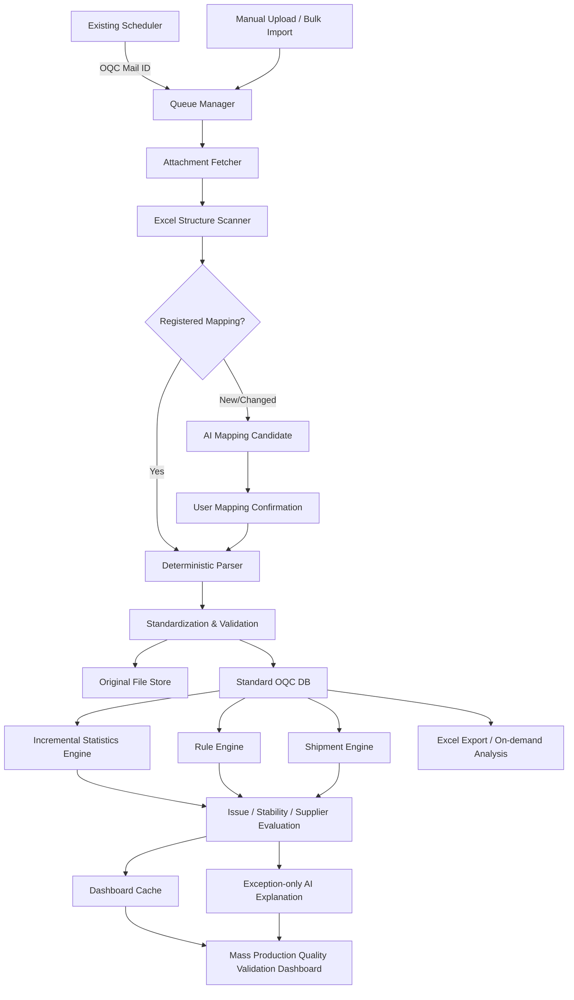

# Mass Production Quality Validation — Codex Master Implementation Specification

> **프로그램 공식 명칭:** Mass Production Quality Validation
> **레거시 명칭 해석:** 기존 프로젝트 문서의 `Valonark OQC AI`는 모두 `Mass Production Quality Validation`로 읽는다. 신규 UI, 코드, API, DB Migration, Export, 문서 제목에는 `Mass Production Quality Validation`를 사용한다.
> **프로젝트 근간:** **양산 OQC 데이터 기반 개발 품질 의사결정 및 사양 최적화 시스템**

**Document Type:** Codex 구현 기획서 / 개발 실행계약 / 수용기준 Baseline  
**Baseline Date:** 2026-08-15  
**Version:** 1.0  
**Current Project State:** 요구사항 및 개념설계 완료 / 구현 착수 전  
**Immediate Resume:** Phase 1 — 대표 OQC 기반 Data Engine  
**Business Requirements:** 기존 330건 + 최신 명칭·근간 요구 3건 = **총 333건**

---

## 0. Codex에게 주는 최상위 실행 명령

이 문서는 아이디어 문서가 아니라 **구현계약서**다. Codex는 아래 규칙을 지키면서 실제 동작하는 프로그램을 단계적으로 제작한다.

### 0.1 반드시 지킬 것

1. 작업 전에 이 문서와 아래 Source of Truth 문서를 모두 읽는다.
2. 구현 결과는 요구사항 ID와 연결한다.
3. `완료`는 코드 작성만으로 선언하지 않는다. **코드 + Test + Acceptance Evidence**가 모두 있어야 한다.
4. 동일 기능을 여러 Module에서 중복 구현하지 않는다. 각 Engine의 소유권 경계를 지킨다.
5. 평균, Cpk, PASS/FAIL, 출하 누적, 업체점수, 공급 안정성 Rule은 일반 코드가 계산한다.
6. AI는 신규 Mapping, 애매한 의미, 측정방법 검토, 이상 설명, 사용자가 실행한 심층분석에만 사용한다.
7. AI 장애 또는 AI 비활성 상태에서도 기존 Mapping 처리, 통계, 출하, Issue, 업체평가, 공급 안정성, Dashboard, Export가 동작해야 한다.
8. 원본 Excel과 승인 이력을 덮어쓰거나 삭제하지 않는다.
9. 공식 기준선은 `VALID` 데이터만 사용한다.
10. 확인되지 않은 의심값, Outlier, 수정본을 임의 삭제하거나 공식값으로 확정하지 않는다.
11. 현재 미확정인 Threshold, 가중치, 등급구간을 Codex가 임의의 최종 업무기준으로 고정하지 않는다. **관리자 설정값 및 Versioned Rule**로 구현한다.
12. 완료 Phase 안에 `pass`, 빈 Stub, 동작하지 않는 버튼, 근거 없는 Mock 판정을 남기지 않는다.
13. 실제 대표 OQC가 없어 검증할 수 없는 항목은 숨기지 말고 `BLOCKED_BY_INPUT`으로 기록한다.
14. 신규 Scope를 임의 추가하지 않는다.
15. 지속적으로 프로그램 부하가 증가하는 구조, 지속 AI 호출이 증가하는 구조, 현재 Scope 밖의 신규 기능만 사용자 확인 대상으로 올린다. 그 외 세부 구현은 합리적으로 결정하고 진행한다.

### 0.2 Source of Truth와 충돌 우선순위

업무 Rule 충돌 시 다음 순서를 따른다.

1. 현재 대화의 최신 사용자 수정사항
2. 본 문서의 최신 확정사항
3. 관련 `WORK_OQC_*.md`
4. `02_OQC_WORK_CORE.md`
5. 프로젝트 맞춤설정
6. 일반적인 통계·품질·소프트웨어 관행

AI 추론과 일반관행은 원본 데이터, Master, 사용자 승인 이력보다 우선할 수 없다.

### 0.3 Codex 작업방식

각 Phase마다 다음 산출물을 만든다.

- 실행 가능한 코드
- DB Migration
- Unit / Integration / E2E Test
- `docs/IMPLEMENTATION_STATUS.md`
- `reports/gates/PHASE_N_GATE_REPORT.md`
- 요구사항 체크리스트 갱신
- 새로 확인된 Risk와 미검증 항목
- 변경된 Architecture Decision Record

권장 명령:

```bash
make bootstrap
make lint
make typecheck
make test
make e2e
make gate PHASE=1
make dev
```

Codex는 위 명령이 실제로 동작하도록 프로젝트 Script를 만든다.

### 0.4 요구사항 추적 강제규칙

`13A_MASS_PRODUCTION_QUALITY_VALIDATION_REQUIREMENTS_CHECKLIST.csv`를 개발 상태의 기준으로 사용한다.

각 Requirement는 다음 상태 중 하나만 가진다.

- `NOT_STARTED`
- `IN_PROGRESS`
- `IMPLEMENTED`
- `VERIFIED`
- `BLOCKED_BY_INPUT`
- `DEFERRED_BY_PHASE`
- `OUT_OF_SCOPE_CONFIRMED`

`VERIFIED` 전환 조건:

- 구현 Code Reference 존재
- 자동 Test Reference 존재
- Acceptance Evidence 존재
- 관련 Phase Gate 통과

Codex는 `scripts/check_requirements.py`를 만들어 다음을 CI에서 실패 처리한다.

- Requirement ID 누락
- `VERIFIED`인데 Code/Test/Evidence가 비어 있음
- 제외 Scope가 구현됨
- 같은 Requirement가 상충하는 두 Module에 중복 구현됨
- Source Business Rule과 다른 Hard-coded Threshold가 들어감

---

## 1. 제품 정의

### 1.1 한 문장 정의

Mass Production Quality Validation는 업체별 비정형 OQC Excel을 모델별 표준 DB로 변환하고, 최신 OQC를 검증된 누적 양산 데이터와 비교하여 **품질 이상, 데이터 신뢰성, 출하 영향, 업체 품질수준, 향후 공급 안정성, 개발 사양 최적화 근거**를 제공하는 시스템이다.

### 1.2 프로그램이 직접 답해야 하는 질문

- 무엇이 새로 들어왔는가?
- 과거 어느 데이터와 비교했는가?
- 무엇이 달라졌는가?
- Spec 이탈인가, Trend 이상인가, 데이터 신뢰성 의심인가?
- 어느 모델·부품·업체·LOT·Sample·Point·Cavity가 문제인가?
- 실제값과 적용 Spec은 무엇인가?
- 기출하·미출하·예정수량은 얼마인가?
- 현재 Issue 상태와 Close 조건은 무엇인가?
- 업체에 무엇을 확인하거나 개선 요청해야 하는가?
- 최근 악화가 향후 공급 안정성에 어떤 영향을 주는가?
- 과거 양산 품질을 신규 개발의 관리항목·CTQ·검사주기·Spec 검토에 어떻게 활용할 수 있는가?

### 1.3 프로그램이 아닌 것

- 단순 Excel Viewer
- 단순 평균·그래프 생성기
- 업체 PASS/FAIL을 그대로 보여주는 도구
- AI가 숫자와 판정을 임의 생성하는 도구
- 다른 모델 데이터를 하나의 통계로 섞는 도구
- 자동 출하 Hold 또는 자동 Spec 변경 도구

---

## 2. 현재 Scope

### 2.1 포함 Scope

1. Scheduler Queue 연계
2. 수동 OQC 업로드 및 과거 일괄등록
3. Excel 전체 구조 Scan
4. 신규 모델·부품·업체·양식 등록
5. Mapping Preview와 Mapping Template
6. 원본 보존 및 표준 DB 적재
7. Master Spec / 제출기준 / 관리 Scope / 측정방법 / 검사주기
8. 최신·최근·장기 품질분석
9. Spec 재판정, Cpk/Ppk, Control Limit, Trend, Outlier
10. 반복값·복붙·수정본 등 데이터 신뢰성 탐지
11. 금번·누적 출하수량 검증
12. LOT-출하 다대다 연결, Exposure, OQC Coverage
13. 알림, Issue 생애주기, 개선효과
14. 생산단계와 공급 안정성
15. 업체평가와 이원화 비교
16. 모델·부품·검사항목 Dashboard
17. 표준 OQC / 제출기준 / 업체평가 Excel Export
18. 기간비교, 신규 Spec 시뮬레이션, 과거 Reference
19. 신규 모델 초기 관리안 제안
20. 관리자 권한, Revision, Audit

### 2.2 명확한 제외 Scope

- 사진 AI 분석
- 측정기 ID / Serial 관리
- 검교정 성적서·유효기간 관리
- 업체 Action 응답속도 자동평가
- 업체 메일 자동 발송
- 자동 출하 Hold
- 자동 Master Spec 변경
- 자동 공급비율 결정
- 고객 Claim 기반 실제 시장 무이슈 실적
- FMEA 작성·관리 기능의 본 구현

FMEA는 향후 Mass Production Quality Validation 양산품질 환류 확장으로 연결할 수 있으나, 현재 Baseline에서는 Extension Point만 고려하고 기능을 구현하지 않는다.

---

## 3. 사용자와 권한

### 3.1 Role

| Role | 권한 |
|---|---|
| `ADMIN` | Master Spec, 제출기준, 관리 Scope, 검사주기, CTQ, 측정방법 승인, Rule Threshold, 업체평가 가중치·Hard Gate, Mapping 최종승인, 데이터 상태 확정 |
| `REVIEWER` | 신규등록·Mapping 검토, Issue 확인·조치·Close 요청, 의심데이터 확인, Export, 심층분석 실행 |
| `VIEWER` | Dashboard 조회, 필터, Drill-down, 허용된 Export |
| `SYSTEM` | Scheduler Queue, Background Worker, Cache 갱신, 자동 Rule 실행 |
| `AI_PROVIDER` | 구조화된 후보와 설명만 반환. DB 직접수정 권한 없음 |

### 3.2 권한 원칙

- Production 인증은 사내 인증 Adapter로 연결한다.
- 빈 Repository에서 시작하는 MVP는 개발용 계정으로 동작할 수 있으나, Production Mode에서는 개발용 우회 인증을 금지한다.
- 모든 관리자 변경은 변경 전·후, 변경일, 변경자, 적용 시작일을 남긴다.
- 중요한 승인에는 승인상태와 승인자를 별도로 보존한다.

---

## 4. 전체 업무 흐름



### 4.1 정상 흐름

1. Queue 또는 수동경로에서 OQC를 받는다.
2. 원본 Hash와 Mail ID로 중복 가능성을 확인한다.
3. 모든 Sheet, 숨김영역, 병합셀, 수식, Header 후보를 Scan한다.
4. 등록양식이면 저장된 Mapping Template으로 해석한다.
5. 신규·변경양식이면 예상 연결위치와 Mapping Preview를 보여준다.
6. 사용자 승인 후 표준 Long Format으로 적재한다.
7. 정상항목은 `VALID`, 의심항목은 항목단위 `PENDING` 또는 `SUSPECT`로 적재한다.
8. 영향 Segment만 통계·Rule·Issue·평가 Cache를 갱신한다.
9. 정상 OQC는 조용히 누적한다.
10. 신규 이상·악화·정상화 후보·기준변경·신뢰성 Risk·Coverage 부족만 알린다.
11. 알림은 해당 모델·LOT·항목으로 Deep Link한다.

### 4.2 실패 흐름

- 파일 전체 실패와 항목 일부 실패를 구분한다.
- 정상항목은 부분 적재할 수 있다.
- 읽을 수 없는 Sheet·영역·Cell을 정확히 표시한다.
- Queue는 Idempotent해야 하며 실패건만 재시도한다.
- AI 실패는 Core Data Flow를 막지 않는다.
- 데이터 손실 우려가 있으면 `ERROR` 또는 `MAPPING_REQUIRED`로 보류하고 자동 확정하지 않는다.

---

## 5. 권장 구현 Architecture

### 5.1 Reference Stack

기존 Repository에 기술 Stack이 있으면 호환되는 방식으로 적용한다. 빈 Repository라면 다음을 기본으로 한다.

#### Backend

- Python 3.12
- FastAPI
- SQLAlchemy 2.x
- Alembic
- Pydantic v2
- Pandas / NumPy
- SciPy 또는 검증된 자체 통계함수
- openpyxl: `.xlsx`, `.xlsm`
- xlrd Adapter: 구형 `.xls`가 실제로 들어올 때
- xlsxwriter 또는 openpyxl: Export
- pytest / hypothesis
- structlog 또는 표준 JSON Logging

#### Frontend

- React
- TypeScript
- Vite
- TanStack Query
- TanStack Table
- React Router
- ECharts 또는 Plotly
- Vitest
- Playwright

#### Storage

- Development: SQLite + Local Read-only Original File Store
- Production-ready: PostgreSQL + Shared File/Object Store Adapter
- Redis, Celery 등 별도 운영부하는 실제 데이터량이 필요할 때만 도입한다.

#### AI

- Provider-neutral `AIProvider` Interface
- 사내 Qwen/EXAONE/OpenAI-compatible Endpoint Adapter 가능
- AI를 끈 상태에서도 Test와 Core 기능이 통과해야 한다.

### 5.2 Repository 구조

```text
mass-production-quality-validation/
├─ backend/
│  ├─ app/
│  │  ├─ api/
│  │  ├─ core/
│  │  ├─ domain/
│  │  ├─ application/
│  │  ├─ ingestion/
│  │  ├─ mapping/
│  │  ├─ master/
│  │  ├─ analytics/
│  │  ├─ shipment/
│  │  ├─ issues/
│  │  ├─ stability/
│  │  ├─ suppliers/
│  │  ├─ export/
│  │  ├─ reference/
│  │  ├─ ai/
│  │  ├─ infrastructure/
│  │  └─ workers/
│  ├─ migrations/
│  └─ tests/
├─ frontend/
│  ├─ src/
│  │  ├─ app/
│  │  ├─ features/
│  │  │  ├─ models/
│  │  │  ├─ ingestion/
│  │  │  ├─ mappings/
│  │  │  ├─ analytics/
│  │  │  ├─ issues/
│  │  │  ├─ shipments/
│  │  │  ├─ suppliers/
│  │  │  ├─ periodic-inspection/
│  │  │  ├─ exports/
│  │  │  └─ admin/
│  │  └─ shared/
│  └─ tests/
├─ fixtures/
│  ├─ golden/
│  ├─ malformed/
│  ├─ duplicate/
│  ├─ shipment/
│  └─ statistics/
├─ docs/
│  ├─ source/
│  ├─ adr/
│  ├─ IMPLEMENTATION_STATUS.md
│  └─ API_CONTRACT.md
├─ reports/gates/
├─ scripts/
├─ docker-compose.yml
├─ Makefile
└─ README.md
```

### 5.3 Layer Rule

- Domain Layer: 상태, Entity, Value Object, 업무 Rule Interface
- Application Layer: Use Case와 Transaction 경계
- Infrastructure Layer: DB, Excel, File Store, Scheduler, AI Adapter
- API Layer: HTTP Contract
- Worker Layer: Queue Polling, Background Processing, Cache Update
- Frontend: 조회·승인·설정·Drill-down UX
- Dashboard는 Engine 결과를 표시할 뿐 자체 판정을 만들지 않는다.

### 5.4 내부 Domain Event

최소 Event:

- `QUEUE_ITEM_RECEIVED`
- `SOURCE_FILE_STORED`
- `MAPPING_CONFIRMATION_REQUIRED`
- `OQC_LOT_INGESTED`
- `DATA_STATUS_CHANGED`
- `SPEC_REVISION_CHANGED`
- `METHOD_REVISION_CHANGED`
- `SHIPMENT_LINKED`
- `COVERAGE_CHANGED`
- `ANOMALY_DETECTED`
- `ISSUE_UPDATED`
- `PRODUCTION_STAGE_CHANGED`
- `SUPPLY_RESUMED`
- `EVALUATION_FINALIZED`

초기에는 DB Outbox Table과 Background Worker로 구현한다. 다른 Message Broker는 필요성이 확인될 때만 도입한다.

---

## 6. Integration Contract

### 6.1 Scheduler Queue Contract

Scheduler는 메일 전체를 읽고 OQC 관련 Mail ID를 전달하는 역할까지만 수행한다.

예시 Payload:

```json
{
  "mail_id": "provider-unique-mail-id",
  "detected_at": "2026-08-15T08:30:00+09:00",
  "source": "scheduler",
  "attachments": [
    {
      "attachment_id": "provider-attachment-id",
      "file_name": "OQC_4695_20260815.xlsx",
      "content_location": "connector-or-mounted-reference",
      "content_sha256": null
    }
  ]
}
```

필수 요구:

- `mail_id + attachment_id` 또는 동등한 Idempotency Key
- 중복 전달 허용, 중복 적재 금지
- 첨부 Fetch 실패와 Parsing 실패 분리
- Scheduler가 OQC 분석·알림을 수행하지 않음
- OQC Module이 Queue의 미처리 ID만 처리

### 6.2 Original File Store

- 원본은 읽기 전용으로 보존한다.
- SHA-256, 수신일, 원본파일명, 모델 후보, LOT 후보를 저장한다.
- 동일 Hash라도 재전송 이력을 보존할 수 있다.
- 원본 File Path를 사용자에게 과도하게 노출하지 않고 수신일·파일명으로 추적한다.
- 파일 삭제는 일반 UI에서 지원하지 않는다.

### 6.3 Workbook Reader

- `.xlsx`와 `.xlsm`은 `data_only=False`와 `data_only=True`를 모두 읽어 수식과 Cached Value를 구분한다.
- VBA는 실행하지 않는다.
- 외부참조, `#REF!`, Macro 의존값은 `CALCULATION_REFRESH_REQUIRED`로 표시한다.
- 보호·암호화를 우회하지 않는다.
- 숨김 Sheet·행·열의 구조를 Scan한다.
- 사진은 존재와 위치 Metadata만 보존하고 분석하지 않는다.

---

## 7. 표준 DB 물리모델

### 7.1 공통 규칙

대부분의 업무 Table은 다음 공통필드를 가진다.

- `id`: UUID
- `created_at`, `updated_at`
- `created_by`, `updated_by`
- `row_version`: 낙관적 Lock
- `is_deleted`: 일반 조회 제외용 Soft Delete
- `source_data_version`
- `rule_version` 또는 `revision_id`가 필요한 경우 명시

삭제 대신 상태와 Revision으로 이력을 보존한다.

### 7.2 Core Master Tables

| Table | 핵심 필드 | 주요 제약 |
|---|---|---|
| `models` | model_code, model_name, lifecycle_status, production_stage | model_code unique |
| `parts` | canonical_name, part_no, part_type | canonical key unique |
| `model_parts` | model_id, part_id, active_from/to, status | model + part unique by active period |
| `suppliers` | supplier_code, supplier_name | supplier_code unique |
| `supplier_part_mappings` | supplier_id, model_part_id, supplier_name_text, supplier_part_no, effective_from/to | Revision 보존 |
| `inspection_items` | canonical_name, item_type, default_unit, section | canonical item key |
| `model_part_items` | model_part_id, item_id, management_status, ctq_flag, criticality, inherited_from | 관리/제외/후보 상태 |
| `item_name_mappings` | supplier_id, source_name, model_part_item_id, method/point context | 이름만으로 무조건 통합 금지 |

### 7.3 Revisioned Configuration Tables

| Table | 핵심 필드 |
|---|---|
| `spec_revisions` | model_part_item_id, target, lsl, usl, unit, revision, effective_from/to, change_reason, source_document, approval_status, approved_by |
| `measurement_method_revisions` | model_part_item_id, method_name, method_status, approved_alternatives, effective_from/to, approval |
| `submission_standard_revisions` | model_id 또는 model_part_id, revision, effective_from/to, approval |
| `submission_standard_rules` | standard_revision_id, required_field, item_id, sample_count, cavity_sample_count, periodic_rule_id, ctq, allowed_method |
| `inspection_schedule_rules` | model_part_item_id, schedule_type, interval_value, window_start/end, active_supply_only |
| `point_definitions` | model_part_item_id, point_code, point_name, coordinate, order, effective_from/to |
| `custom_item_formula_revisions` | output_item_id, expression_ast, input_item_ids, effective_from/to, reason |
| `rule_config_revisions` | scope_level, scope_id, rule_code, parameters_json, effective_from/to, approval |
| `evaluation_weight_revisions` | axis_code, weight, hard_gate_json, effective_from/to, approval |
| `export_template_revisions` | template_name, version, file_location, effective_from/to |

### 7.4 Ingestion and Traceability Tables

| Table | 핵심 필드 |
|---|---|
| `queue_items` | mail_id, attachment_id, status, retry_count, last_error, heartbeat_at, idempotency_key |
| `source_messages` | mail_id, detected_at, received_at, subject_metadata |
| `source_files` | message_id, original_name, sha256, extension, file_store_uri, parse_status, received_at |
| `source_sheets` | source_file_id, sheet_name, hidden_state, used_range, merged_ranges_json, formula_count, parse_warnings |
| `mapping_templates` | supplier_id, model_id nullable, format_fingerprint, revision, status, template_json, approved_by |
| `mapping_decisions` | source_file_id, candidate_json, confirmed_json, changed_fields, approver |
| `ingestion_jobs` | source_file_id, status, start/end, counts, error_summary |
| `oqc_lots` | model_id, model_part_id, supplier_id, lot_no, production_date, inspection_date, received_date, spec_revision_id, source_file_id |
| `production_subgroups` | oqc_lot_id, production_date, shift, plant, line, mold_no, subgroup_code |
| `inspection_results` | oqc_lot_id, model_part_item_id, method_revision_id, supplier_judgment, system_judgment, data_status |
| `measurements` | inspection_result_id, sample_no, point_id, cavity, raw_value_text, raw_numeric_value, display_value, standardized_value, source_sheet, source_cell, formula_flag, data_status, superseded_measurement_id |

필수 Index:

- `source_files.sha256`
- `queue_items.idempotency_key`
- `oqc_lots(model_id, model_part_id, supplier_id, lot_no)`
- `measurements(inspection_result_id, sample_no, point_id, cavity)`
- `inspection_results(model_part_item_id, data_status)`
- 비교 Segment를 위한 `(model_id, model_part_id, supplier_id, item_id, spec_revision_id, method_revision_id, production_stage)`

### 7.5 Shipment Tables

| Table | 핵심 필드 |
|---|---|
| `shipment_events` | model_id nullable, model_part_id, supplier_id, shipment_no, shipment_date, quantity, shipment_type |
| `shipment_plans` | model_part_id, supplier_id, planned_date, planned_quantity, status |
| `oqc_shipment_links` | oqc_lot_id, shipment_event_id, linked_quantity, match_status, match_method |
| `supplier_cumulative_reports` | oqc_lot_id, previous_reported, current_shipment, reported_cumulative, system_cumulative, discrepancy |
| `coverage_snapshots` | scope, period, actual_shipment_qty, oqc_confirmed_qty, coverage_rate, missing_reason_json, data_version |
| `incomplete_evidence_shipments` | shipment_event_id, coverage_at_ship, missing_scope_json, completed_at |

### 7.6 Analytics, Issue, Evaluation Tables

| Table | 핵심 필드 |
|---|---|
| `analytics_cache` | segment_key, count, mean, m2, min, max, stddev, cpk, ppk, ucl, lcl, recent_summary_json, data_version, calculation_version |
| `anomaly_occurrences` | anomaly_type, severity, oqc_lot_id, item_id, point/cavity, actual_json, comparator_json, evidence_json, rule_version |
| `user_rule_exceptions` | rule_code, scope, pattern_signature, approval_reason, effective_from/to, absolute_gate_excluded |
| `issues` | issue_key, state, priority, first_lot_id, latest_lot_id, recurrence_count, cause, supplier_action, action_date, close_condition |
| `issue_occurrences` | issue_id, anomaly_occurrence_id, occurrence_type, trend_state |
| `change_events` | event_type, model/part/supplier, event_date, 4M/mold/spec/method details |
| `improvement_assessments` | issue_id, before_window, after_window, mean/std/cpk change, recurrence, normal_lots, normal_shipment_qty, status |
| `supply_stability_assessments` | model_part_id, supplier_id, product_quality_status, oqc_operation_status, overall_status, confidence, driver_json |
| `supplier_evaluations` | supplier_id, model_part_id nullable, period, status, score, grade, confidence, finalized_at |
| `supplier_evaluation_axes` | evaluation_id, axis_code, score, weight, evidence_json, root_event_id |
| `supplier_comparisons` | model_part_id, item_id, supplier_a/b, result, confidence, evidence_json |
| `notifications` | type, severity, entity_link, state, first_seen, last_seen, suppressed_reason |
| `audit_logs` | actor, action, entity_type/id, before_json, after_json, effective_from |

### 7.7 On-demand and Reference Tables

| Table | 핵심 필드 |
|---|---|
| `analysis_jobs` | analysis_type, parameters_json, requested_by, status, data_version, result_uri, stale_flag |
| `analysis_results` | job_id, summary_json, detailed_metrics_json, ai_explanation_id |
| `model_references` | target_model_id, reference_model_id, similarity_dimensions_json, evidence_strength, user_selected |
| `reference_item_decisions` | target_model_id, reference_model_id, item_id, decision, reason |
| `ai_explanations` | purpose, input_hash, provider, model, status, response_json, validation_error |

---

## 8. 상태모델

### 8.1 Queue

```text
PENDING
  → PROCESSING
      → DONE
      → REGISTRATION_REQUIRED
      → MAPPING_REQUIRED
      → ERROR
ERROR → PENDING (retry)
stale PROCESSING → PENDING (safe recovery)
```

- `DONE`은 재처리하지 않는다.
- Idempotency Key가 같으면 새 적재를 만들지 않는다.
- Retry Count와 Last Error를 남긴다.
- 중단된 `PROCESSING`은 Heartbeat Timeout 후 안전하게 복구한다.

### 8.2 Data Status

```text
PENDING → VALID
PENDING → SUSPECT
PENDING → EXCLUDED
VALID → SUSPECT
VALID → EXCLUDED
VALID → REPLACED
SUSPECT → VALID
SUSPECT → EXCLUDED
SUSPECT → REPLACED
EXCLUDED → VALID (복구)
```

- `VALID`만 공식 통계에 사용한다.
- `SUSPECT`는 의심이며 허위 확정이 아니다.
- `EXCLUDED`는 삭제가 아니다.
- `REPLACED`는 최신 승인본에 의해 대체된 과거값이다.
- 모든 전이는 이유·처리자·처리일을 남긴다.

### 8.3 Issue

```text
미확인 → 확인 완료 → 조치 중 → 정상화 확인 → Close
Close → 조치 중 (재발)
```

- 알림을 봤다는 사실과 Issue 해결을 분리한다.
- 중요 Issue는 사용자 확인 없이 Close하지 않는다.
- 경미 Trend는 설정된 연속정상 조건을 충족하면 자동 Close할 수 있다.
- 주기검사는 Lot 수가 아니라 검사 횟수로 정상화한다.

### 8.4 Model / Supply Lifecycle

- `ACTIVE_SUPPLY`
- `TEMPORARILY_STOPPED`
- `ARCHIVED`
- `RESUPPLY_VALIDATION`

### 8.5 Production Stage

- `RAMP_UP`
- `STABILIZING`
- `NORMAL_PRODUCTION`
- `POST_CHANGE_RESTABILIZATION`
- `RESUPPLY_VALIDATION`

전환은 Event로 제안하되 사용자가 수정할 수 있다.

---

## 9. 기능 상세 — Ingestion & Mapping

### 9.1 입력 Route

- Scheduler Queue
- 수동 단건 업로드
- 과거 OQC 일괄 업로드
- Golden Test 업로드

유입경로가 달라도 동일한 Parsing·Validation·DB 적재 Pipeline을 사용한다.

### 9.2 신규대상 분류

자동 분류 후보:

- 신규 모델
- 기존 모델의 신규 부품
- 기존 모델·부품의 신규 업체
- 기존 업체 양식 변경
- 신규 검사항목
- 동일파일 재전송
- 동일 LOT 재검
- 동일 LOT 수정본

등록 전 예상 연결위치를 보여준다.

예:

```text
4695 → Out Box → 신규 업체 B OQC로 판단
근거: Excel B2 모델명, Sheet명 Out Box, 업체명 Cell D3
```

### 9.3 Structure Scanner 출력

- Sheet명 / Visibility
- Used Range
- Merged Range
- Header 후보
- 데이터 Type 분포
- 수식 / Cached Value / 외부참조 / 오류
- 반복 Header와 중간 Section
- 빈행, 서명란, 비고란
- 대표행·대표열
- 숨김 Raw Data 후보
- 사진 위치 Metadata

### 9.4 Mapping Preview

한 화면에서 원본과 추출결과를 대조한다.

필수 Preview:

- 모델 / 부품 / 업체
- LOT / 생산일 / 검사일 / 수신일
- Spec Revision
- 금번 / 누적 출하수량
- 검사항목 / Section
- Target / LSL / USL / 단위
- 측정방법
- Sample / Point / Cavity
- Raw Value / Display Value / Standardized Value
- 업체 판정 / 시스템 재판정
- Source Sheet / Cell

사용자는 잘못 읽힌 항목만 수정한다.

### 9.5 Mapping Template

코드에 업체별 Cell 주소를 하드코딩하지 않는다.

예시:

```json
{
  "template_version": 1,
  "format_fingerprint": {
    "sheet_names": ["Summary", "Dimension"],
    "header_tokens": ["LOT", "Spec", "Sample"],
    "merged_range_signature": "..."
  },
  "identifiers": {
    "model": {"sheet": "Summary", "cell": "B2", "transform": "trim"},
    "supplier": {"sheet": "Summary", "cell": "D2", "transform": "trim"},
    "lot": {"sheet": "Summary", "cell": "B4", "transform": "trim"}
  },
  "sections": [
    {
      "name": "Dimension",
      "sheet": "Dimension",
      "header_row": 8,
      "item_name_column": "B",
      "target_column": "C",
      "lsl_column": "D",
      "usl_column": "E",
      "sample_range": "F:O",
      "point_strategy": null,
      "cavity_strategy": null
    }
  ]
}
```

Template은 Revision, 승인자, 적용기간, 양식 Fingerprint를 가진다.

### 9.6 대량 적재

1. 대표 1건 Mapping 승인
2. 동일양식 자동처리
3. 다른 파일만 예외 분리
4. 정상파일 개별승인 금지
5. 예외만 사용자 확인
6. 총 파일 / 정상 / 변경 / 보류 / 수정본 요약
7. 미해결항목이 0 또는 승인된 보류상태가 된 뒤 초기 DB Gate 완료

### 9.7 다중구조

- 메일 여러 첨부 각각 처리
- 한 Excel 여러 모델 분리
- 여러 Sheet 관계 보존
- 한 파일 여러 LOT·검사일 독립 적재
- 같은 LOT 여러 생산일은 Sub-group
- 모델·부품 식별 충돌 시 자동확정 금지

### 9.8 단위·정밀도

- 변환이 명확할 때만 표준단위 환산
- 원본값·원본단위 보존
- 실제 저장값과 Excel 표시값 분리
- 표시 자릿수만으로 정밀도 저하 판정 금지
- 실제 저장값의 분해능이 달라지면 확인 전 고정밀 통계와 혼합 금지

### 9.9 수정본과 재검

- 동일 LOT의 초회·재검·수정본을 구분한다.
- 파일명에 `수정`이 없어도 값·Spec·판정·출하수량 차이를 감지한다.
- 문구만 변경된 경우 자동 반영 가능
- 품질판단 영향 변경은 사용자 승인 필요
- 승인 후 과거값 `REPLACED`
- NG→PASS, 공차완화, Spec 안쪽 값 수정은 고중요도로 표시
- 수정 전 이상판정 이력은 삭제하지 않는다.

### 9.10 부분 적재

40개 항목 중 38개 정상, 2개 의심이면:

- 38개 `VALID`
- 2개 `PENDING` 또는 `SUSPECT`
- 공식 통계에는 38개만 사용
- Dashboard에 빠진 항목과 사유 표시

---

## 10. 기능 상세 — Master & Configuration

### 10.1 Master Spec

OQC 기재 Spec과 Master Spec을 분리한다.

신규 OQC마다:

1. 최근 OQC Spec
2. 검사일 기준 유효 Master Spec
3. 최신 OQC 기재 Spec

을 비교한다.

사용자 승인 전 업체 공차 변경을 Master로 인정하지 않는다.

### 10.2 Revision

모든 Revision은 다음을 보존한다.

- 변경 전 / 후
- Revision
- 적용 시작일
- 종료일
- 변경사유
- 근거문서
- 승인상태
- 승인자

과거 판정은 당시 Revision 기준을 유지한다.
현재 Master 재평가는 On-demand 옵션이다.

### 10.3 제출기준

기본 필수항목:

- 모델
- 부품명 / 품번
- 업체
- LOT
- 검사일
- Spec Revision
- 금번 출하수량
- 업체 누적 출하수량

모델·부품별로 생산일, 공장, Line, 금형, Cavity, 작업조를 추가 필수화할 수 있다.

### 10.4 관리 Scope

항목 상태:

- `MANAGED`
- `ANALYSIS_EXCLUDED`
- `NEW_ITEM_CANDIDATE`
- `MAPPING_REQUIRED`

신규항목 데이터는 보존하되 결정 전 공식 Trend에 섞지 않는다.

### 10.5 Item Type

- 연속형 치수
- 일방향 상한
- 일방향 하한
- 물성 / 강도
- 외관 OK/NG
- 외관 불량유형 / 발생수
- 다중 Point
- 좌표 X/Y
- 사용자 정의 계산항목

Item Type별 통계와 시각화를 Strategy Pattern으로 분리한다.

### 10.6 검사주기

- 매 LOT
- 주 1회
- 월 1회
- 4~5주
- 사용자 지정 Window
- 초기 N Lot 연속
- 정기검사 N회 연속

공급중단 기간은 지연으로 계산하지 않는다.
다음 검사 Window와 예정·정상·지연을 표시한다.

### 10.7 Sample / Point / Cavity

항목별:

- 기본 Sample 수
- Cavity별 Sample 수
- Point 목록과 정의
- Point 순서
- 생산일·작업조 Sub-group

전체 Sample 수가 맞아도 특정 Cavity가 미검사면 별도 경고한다.

### 10.8 측정방법

관리대상은 장비 ID가 아니라 측정방법이다.

- 승인방법
- 승인 가능한 대체방법
- 미승인 신규방법
- 적용일

신규방법:

1. 변경점 표시
2. AI 적절성 검토
3. 사용자 승인
4. 이후 같은 Scope에서 재사용

부적절한 방법으로 측정한 최초값은 이력으로 보존하고 승인 재측정값만 공식통계에 쓴다.

### 10.9 사용자 정의 항목

지원:

- 사칙연산
- 절대값
- 차이
- 합계
- 승인된 단순함수

입력 하나라도 없으면 계산하지 않는다.
임의 보정하지 않고 결측 원본항목을 보여준다.
계산식 Revision을 관리하고 과거 재계산은 On-demand다.

### 10.10 설정 상속

우선순위:

1. 전 프로젝트 공통
2. 부품 Type 공통
3. 모델
4. 모델·부품
5. 업체별 승인 예외

Override가 없으면 상위설정을 상속한다.
어떤 설정이 어디서 상속되었는지 UI에서 표시한다.

---

## 11. 기능 상세 — Quality Analytics

### 11.1 비교군 선택

필수 동일조건:

- 모델
- 부품
- 검사항목

우선 동일조건:

- 업체
- Spec Revision
- 측정방법
- 생산단계
- 공장 / Line
- 금형 / Cavity

비교순서:

1. 최신 Lot 자체 Spec
2. 동일조건 최근 N Lot
3. 동일조건 전체 누적
4. 조건이 다른 장기 Reference

Reference는 공식 통계에 혼합하지 않는다.

### 11.2 데이터 부족

- Master Spec 판정은 즉시 수행
- Trend / Cpk / UCL-LCL은 `기준 데이터 축적 중`
- 유사모델은 Reference
- 산출 불가와 참고수준을 구분

### 11.3 Spec 판정과 Trend 판정

Spec 판정:

- Master 기준 PASS/FAIL
- 업체 판정과 시스템 판정 비교
- OQC Spec과 Master Spec 비교

Trend 판정:

- 평균 Shift
- 산포 확대
- Cpk 하락
- 연속 악화
- Control Limit 이탈
- Point/Cavity 편향
- 한계방향 연속 접근

UI에 두 판정을 별도 표시한다.

### 11.4 항목유형별 분석

연속형:

- 평균, Min, Max, Range, 표준편차
- Spec Margin
- Cp/Cpk/Pp/Ppk
- Trend, UCL/LCL, Outlier

일방향:

- 상·하한 Margin
- 한계 접근률
- 악화방향
- 적합률 또는 공정능력

외관:

- 검사수량
- NG 수량 / NG율
- 불량유형
- 신규 / 반복 불량유형

다중 Point / Cavity:

- 위치별 평균·산포·Cpk
- 반복 편향
- 전체 정상 / 특정 위치 열세 구분

### 11.5 최신 OQC 요약

최신 Lot 상단에 3~5줄:

- 무엇이 달라졌는가
- Spec 이탈 여부
- Trend 이상
- 신뢰성 의심
- 출하 / Coverage 영향
- 다음 Action

각 문장은 실제 Trend·Sample·비교 Lot로 Deep Link한다.

### 11.6 이상 시작점

자동 탐색:

- 최초 Shift
- 산포 확대 시작
- 연속 악화 Lot 수
- 일회성 / 지속 / 재발
- 4M·금형·Spec·방법 변경과 시간관계

### 11.7 동반 변화

같은 시점에 움직인 다른 검사항목을 찾아 `연관 가능성`으로 보여준다.
원인으로 확정하지 않는다.

### 11.8 시간축

1. 생산일
2. 검사일
3. 수신일

출하 Trend는 출하일을 사용한다.

### 11.9 값·형식 이상

- 빈칸
- N/A / `-` / OK가 숫자영역에 입력
- 단위 변경
- 실제 정밀도 변화
- 수식·상수 혼재
- 일부 Cell 형식 변화
- 날짜·LOT 형식 변화

### 11.10 데이터 신뢰성

- Exact Duplicate
- Partial Duplicate
- 반복주기
- 다수항목 동시복제
- 소수점 패턴
- 수정본 방향성

표시는 반드시 다음을 포함한다.

- 항목
- 날짜
- LOT
- Sample 범위
- Point / Cavity
- 비교대상
- 일치율 또는 동일 범위
- 원본 Cell

의심만으로 자동 제외하지 않는다.

### 11.11 Outlier

Outlier는 자동 삭제하지 않는다.

표시:

- 실제값
- Spec Margin
- 누적분포 위치
- Point / Cavity / 생산일
- 공식 Cpk
- Outlier 제외 참고 Cpk

공식 Cpk와 참고 Cpk를 혼동하지 않는다.

### 11.12 사용자 예외승인

Rule 이상을 사용자가 정상 예외로 승인하면 동일 패턴의 경고강도를 조정할 수 있다.
다만 Spec 이탈, 필수정보 누락, 공차 불일치 등 Absolute Gate는 무시할 수 없다.

---

## 12. 통계 계산 계약

### 12.1 기본 공식

- Mean: 산술평균
- Range: Max - Min
- Sample Standard Deviation: `ddof=1`
- `Cp = (USL - LSL) / (6 × σwithin)`
- `Cpk = min((USL - Mean)/(3 × σwithin), (Mean - LSL)/(3 × σwithin))`
- `Pp = (USL - LSL) / (6 × σoverall)`
- `Ppk = min((USL - Mean)/(3 × σoverall), (Mean - LSL)/(3 × σoverall))`
- 상한만 있는 항목: `(USL - Mean)/(3 × σ)`
- 하한만 있는 항목: `(Mean - LSL)/(3 × σ)`

### 12.2 Within / Overall Sigma

- Sub-group 정보가 유효하면 Cp/Cpk는 Pooled Within Sigma를 사용한다.
- Sub-group이 없으면 구현 Default로 Sample Sigma를 사용하되 계산방법을 결과에 표시한다.
- Pp/Ppk는 전체 관측치 Sigma를 사용한다.
- 모든 계산은 `calculation_method_version`을 저장한다.

이 부분은 통계구현 Default이며, 실제 품질관리 기준이 확정되면 Rule Revision으로 교체할 수 있어야 한다.

### 12.3 Control Limit

업무문서에는 Control Chart 세부종류가 확정되지 않았다.

따라서:

- `ControlLimitStrategy` Interface를 만든다.
- MVP Default는 동일조건 `VALID` Lot-Level Statistic에 대한 3-Sigma Reference Limit이다.
- Sample Sub-group이 명확하면 Xbar-R 또는 Xbar-S Strategy를 추가할 수 있다.
- 데이터 충분성 미달이면 UCL/LCL을 생성하지 않는다.
- Control Limit을 Spec Limit처럼 PASS/FAIL에 사용하지 않는다.

### 12.4 Data Sufficiency

다음 값은 관리자 Config다.

- 최소 Lot 수
- 최소 Sample 수
- 최근 N Lot
- Cpk 정식표시 기준
- Duplicate 의심 Threshold
- Shift / 산포 / Outlier Threshold

Codex가 임의 업무기준으로 고정하지 않는다.
기본값을 제공할 경우 `PROVISIONAL_DEFAULT`로 표시하고 관리자 화면에서 변경 가능해야 한다.

### 12.5 Cache

Welford 방식 또는 동등한 수치안정 Incremental Algorithm으로:

- Count
- Mean
- M2
- Min / Max

를 갱신한다.

Cpk, Control Limit, 최근 N Lot은 영향 Segment만 재계산한다.
Data Status 변경, Spec 변경, 방법 변경 시 해당 Segment Cache를 무효화한다.

---

## 13. 기능 상세 — Shipment & Exposure

### 13.1 누적 검증

매 OQC에서:

```text
직전 업체 누적 + 금번 출하 = 이번 업체 누적
업체 기재 누적 ↔ 프로그램 DB 누적
```

불일치 시:

- 마지막 일치 OQC
- 최초 불일치 OQC
- 이후 차이 증감
- 해당 구간 금번출하 합계

를 보여준다.

누적 역전은 자동 덮어쓰지 않는다.

### 13.2 누적 기준

기본 Key:

```text
모델 + 부품 + 업체
```

Spec Revision이 바뀌어도 총 누적은 리셋하지 않는다.
변경 전후 구간조회는 별도 제공한다.

### 13.3 모델출하와 부품출하

Top Tray 700,000 + Bottom Tray 700,000을 모델 1,400,000으로 계산하지 않는다.
모델출하량은 별도 Source가 있을 때만 표시한다.

### 13.4 출하구분

- 계획수량
- 실제출하
- 미출하 잔량
- 예정수량

Exposure는 실제출하 기준이다.

### 13.5 다대다

- 한 LOT 여러 출하
- 한 출하 여러 LOT

모두 지원한다.
매칭정보가 없으면 임의배분하지 않는다.

### 13.6 이상 영향수량

Issue에:

- 총 LOT 수량
- 기출하
- 미출하
- 예정
- 영향 가능수량

을 표시한다.

생산일·Cavity별 수량이 있을 때만 범위를 좁힌다.
정보가 없으면 균등분할하지 않는다.

### 13.7 OQC NG율과 Exposure

예:

```text
OQC 검사 50 EA / NG 1 EA → OQC NG율 2%
LOT 출하 12,000 EA → 영향 가능 출하수량 12,000 EA
```

`12,000 EA 중 2%가 불량`이라고 계산하지 않는다.

### 13.8 Coverage

```text
OQC 확인 완료 출하수량 / 실제 출하수량
```

미Coverage 원인:

- OQC 미수신
- Mapping 보류
- LOT-출하 연결 실패
- 부품 OQC 누락
- 수정본 확인대기
- 중요 CTQ 보류

Coverage는 품질 Fail이 아니라 품질근거 확보수준이다.

### 13.9 출하 전 경고

출하예정일, OQC 제출예정, CTQ, 정기검사 Window를 함께 본다.

- 출하 3일 전 / OQC 내일 예정 → 정상대기
- 출하 당일 / OQC 미수신 → 확인필요

자동 Hold하지 않는다.

### 13.10 미완성 출하 이력

나중에 OQC가 들어와도 출하시점의 미완성 상태를 지우지 않는다.

---

## 14. 기능 상세 — Issue & Supply Stability

### 14.1 Issue Key

기본 구성:

```text
model_part + supplier + inspection_item + failure_pattern
+ optional point/cavity/context
```

동일 Failure Pattern은 같은 Issue에 Occurrence로 추가한다.

### 14.2 알림

발생:

- 신규 이상
- 기존 이상 악화
- 정상화 후보
- Spec / 공차 / 방법 변경
- 신뢰성 Risk
- 신규등록 / Mapping
- 정기검사 지연
- Coverage 부족

억제:

- 정상 OQC
- 동일 Issue가 같은 수준으로 지속
- 승인방법 유지
- 정상 정기검사

### 14.3 우선순위

반영:

- Spec 이탈
- CTQ
- Margin
- 변화크기
- 지속 / 재발
- 신뢰성 중대도
- 기출하 Exposure
- 예정출하
- 생산단계

점수는 설명 가능한 Rule로 계산하고 Hard Gate는 평균점수로 상쇄하지 않는다.

### 14.4 개선효과

업체의 `개선완료` 문구로 인정하지 않는다.

비교:

- 평균
- 산포
- Cpk
- Spec 근접률
- 재발
- 연속 정상 Lot
- 개선 후 정상 출하수량

상태:

- 개선효과 미확인
- 초기 개선 확인
- 개선 정착 관찰
- 개선 정착
- 재발

### 14.5 공급 안정성

평가단위:

```text
모델 → 부품 → 업체
```

표시:

- 제품 품질 안정성
- OQC 운영 안정성
- 종합 공급 안정성
- 판단 신뢰도

등급:

- `안정`
- `관찰`
- `Risk`

### 14.6 판단 입력

- 최근 / 장기 공정능력
- 평균·산포 방향
- CTQ
- 반복 이상·재발
- 개선 정착
- 정상 출하실적
- 정기검사 최신성
- Coverage
- 데이터 신뢰성
- 생산단계
- 데이터 충분성

### 14.7 선제경고

현재 Spec 문제 없이 Cpk가 연속하락하면 `안정 → 관찰 전환 가능성`을 표시한다.
Risk를 끌어올리는 항목은 설명 가능한 기여도 또는 순위로 보여준다.

### 14.8 Ramp-up

초기 데이터는 정상양산 기준선에 섞지 않는다.

항목별 Gate 예:

- 일반치수 최근 N Lot 안정
- 중요 CTQ 최근 N Lot + Cpk 기준
- BCT N회 연속 정상
- 동일 외관 NG 재발 없음
- 미해결 신뢰성 Issue 없음

Lot 수만 지나면 자동 전환하지 않는다.

### 14.9 강화관리

프로그램은 강화관리를 제안하고 사용자가 승인한다.

- 임시 Sample 확대
- 임시 CTQ
- 초기 연속확인
- 정기검사 조기실시

적용사유, 기간, 종료조건, 결과를 관리한다.

### 14.10 4M / 재공급

- 변경점을 Trend에 표시
- 변경 전/후 기준선 분리
- 변경 직후 새 기준선 확정 금지
- 안정화 Gate 후 새 공정 기준선
- Master Spec 자동변경 금지
- 공급중단 중 주기·미제출 감점 금지
- 재공급 검증 후 정상양산 복귀

---

## 15. 기능 상세 — Supplier Evaluation

### 15.1 평가단위

- 모델·부품·업체
- 생산공장 / Line
- 업체 전체 종합

금형·Cavity는 필터와 취약점 분석축이다.

### 15.2 공식 평가축

1. 공정능력
2. 품질 안정성
3. Spec 이탈 / 반복이상 / 재발
4. 정기검사 준수
5. OQC 데이터 신뢰성
6. 제출기준·Coverage 준수
7. 누적 OQC 정상 출하실적

업체 대응속도는 제외한다.

### 15.3 생산단계

정식점수는 정상양산 중심이다.
초기, 재안정화, 재공급은 별도 참고지표다.

단, 허위, NG 은폐, Spec 임의변경은 생산단계와 무관하게 반영한다.

### 15.4 최근과 장기

- 최근 1개월
- 최근 3개월
- 연간 / 장기
- 현재 품질
- 장기 신뢰도
- 개선 / 유지 / 악화

최근 악화가 장기점수에 묻히지 않게 한다.

### 15.5 평가 신뢰도

- 기간
- Lot 수
- 출하수량
- 비교 가능한 CTQ
- 최신 정기검사
- Coverage

데이터 부족업체는 참고점수이며 공식순위에서 보류한다.

### 15.6 데이터 신뢰성 중대도

- 경미: 단순 오타
- 주의: 반복값·복붙 의심
- 중대: 측정값 수정, NG→PASS, 공차 임의변경
- 최중대: 허위 데이터 확인

`SUSPECT`와 `CONFIRMED`를 분리한다.

### 15.7 사건 중복감점 금지

한 사건이 여러 평가축에 걸려도 `root_event_id`로 묶어 Penalty 상한을 적용한다.
반복사건은 추가감점 가능하다.

### 15.8 허위 Hard Gate

확인된 허위는 다른 점수로 상쇄하지 못하게 등급상한을 둔다.
회복후보는 자동 해제하지 않고 사용자 승인한다.
과거 이력은 보존한다.

### 15.9 이원화 비교

동일 모델·부품 내에서 동일 Spec·방법·생산단계의 공통항목을 비교한다.

항목결과:

- A 우위
- 동등
- B 우위
- 판단 보류

반영:

- 차이 크기
- 지속성
- Lot 수
- 출하량
- CTQ
- 판단 신뢰도

사소한 Cpk 차이를 우위로 과대평가하지 않는다.

### 15.10 공급비중 근거

- 공급 확대에 유리
- 현 수준 유지
- 품질 안정화 전 비중확대 주의

만 제시한다.
가격·납기·생산능력과 최종 비율은 자동결정하지 않는다.

### 15.11 평가 확정

월간·분기·연간 평가를 자동계산하고 사용자가 확정한다.
확정점수는 자동변경하지 않는다.
사후 중대사실은 `최초점수`와 `사후 재평가점수`를 함께 남긴다.

---

## 16. Dashboard와 UX

### 16.1 기본 Navigation

- 모델 현황
- 이상 / Issue
- 업체평가
- 정기검사
- Export
- 관리기준 설정

프로그램 실행 시 Queue 처리와 무관하게 모델 현황판을 먼저 보여준다.

### 16.2 모델 현황판 정렬

1. 미확인 이상
2. 공급 안정성 Risk / 관찰
3. 정기검사 지연
4. 출하 전 Coverage 부족
5. 정상

### 16.3 모델카드

- 모델명
- 최신 OQC
- 미확인 / 진행 Issue
- 공급 안정성
- 판단 신뢰도
- 출하실적
- 최근 Exposure
- 생산상태

모델출하 Source가 없으면 부품수량을 대체표시하지 않는다.

### 16.4 모델 Dashboard

상단:

- 최신 OQC 변화
- Spec 이탈
- 악화 / 개선
- 신뢰성
- 기준변경
- 검사주기 / Coverage
- 핵심판단 3~5줄

중단:

- 부품별 상태

하단:

- 검사항목 Card
- 최신값
- 최근변화
- Cpk
- 상태

### 16.5 검사항목 상세

- 최신 Lot
- Spec / Revision
- 최근 N / 전체 Trend
- 평균 / Min / Max / 산포
- Cpk/Ppk
- UCL/LCL
- 업체비교
- Point / Cavity
- Issue
- Change Event

LOT 클릭:

- Sample 실제값
- 업체판정 / 재판정
- 원본 Sheet / Cell

### 16.6 시각화

- 기본은 Trend
- 분포는 On-demand
- Point Heatmap은 실제 위치정보가 있을 때만
- Cavity Filter
- 모든 이상문장은 근거화면으로 연결

### 16.7 정기검사

전체 모델에서:

- 모델 / 부품 / 업체 / 항목
- 마지막 검사
- 다음 Window
- 예정 / 정상 / 지연
- 공급상태

### 16.8 Issue 화면

Filter:

- 미확인
- 조치 중
- 정상화 후보
- Close
- 신뢰성
- Spec / Trend / Coverage / 정기검사

각 Issue는 근거, Exposure, 원인, 조치, Close 조건, 다음 확인사항을 보여준다.

---

## 17. Export

### 17.1 표준 OQC Excel

Filter:

- 날짜
- 기간
- LOT
- 모델
- 부품
- 업체
- 검사항목

기본:

```text
모델 1개 = Excel 1개
Summary + 부품별 Sheet
```

같은 모델의 여러 업체를 같은 Workbook에서 구분한다.

### 17.2 기본 포함

- 관리항목
- 원본 측정값
- Spec
- 업체 / 시스템 판정
- 비교결과
- 통계
- 이상
- 출하

옵션:

- 분석 제외항목
- 전체 원본항목
- 사용자 정의 항목
- 현재 Master 재평가
- 당시 상태
- Trend 그래프

### 17.3 Summary

- 모델 / 부품 / 업체
- LOT / 검사일
- 금번 / 누적 출하
- 검사대상 항목 수
- Spec 이탈
- Trend 이상
- 신뢰성
- 기준변경
- Coverage
- 주요 확인사항
- Issue 상태
- 원인 / 조치 / 확인예정

과거기간 Export라도 기본은 최신 Issue 상태를 붙이고, `당시 상태`를 옵션으로 제공한다.

### 17.4 Template

- Template Revision
- 적용일
- 공통양식
- 모델·부품별 동적배치
- 과거 Export는 당시 형태 유지

실제 당사 Template이 아직 없으므로 Codex는 Template Registry와 기본 Fallback Template을 구현한다.
최종 Corporate Layout Gate는 원본 Template 입수 후 닫는다.

### 17.5 기타 Export

- 업체 OQC 제출기준
- 월간·분기·연간 업체평가
- 기간비교 결과
- 신규 Spec 시뮬레이션 결과

---

## 18. On-demand 분석과 Reference

### 18.1 공통원칙

다음은 상시 계산하지 않는다.

- 분포 전체중첩
- 두 기간 전수비교
- 신규 Spec 검토
- 전체 과거 재평가
- 과거모델 상세 Reference

결과에:

- 대상
- 조건
- DB Version
- Rule Version
- 실행자
- 실행일

을 저장한다.
신규 데이터가 들어오면 `재분석 필요`로 표시한다.

### 18.2 기간비교

예:

- 개선 전 4주 ↔ 개선 후 4주
- 4M 전 ↔ 후
- 분기 간
- 업체 A ↔ B

비교:

- 평균
- 산포
- Cpk
- 이상발생
- 출하실적
- Coverage
- 주요 변화항목
- 원인 LOT / Sample Drill-down

### 18.3 신규 Spec 검토

도면 Spec 후보와 사내 관리기준 후보를 분리한다.

입력:

- 장기 / 최근 분포
- Cpk/Ppk
- 업체별 달성수준
- 기존 Margin
- 기능·조립·설비 요구
- 유사모델 Reference

기능한계 근거가 없으면 도면 Spec 변경후보로 강하게 올리지 않는다.

시뮬레이션:

- 과거 Fail률
- 최근 Fail률
- 업체별 Cpk
- 평균 Shift 민감도
- 예상 이탈 Risk
- 병목업체

자동 Spec 변경 금지.

### 18.4 검사항목 검색

활성·Archive 모델에서 검색:

- Spec
- 관리기준
- 주기
- 방법
- 공정능력
- 정상출하
- 이상·개선이력

다른 모델 통계는 합치지 않는다.

### 18.5 신규 모델 Reference

유사도 후보근거:

- 부품구성
- 검사항목
- Spec 구조
- 측정방법
- 재질
- 중량
- 사용조건
- 적재조건
- 양산 Lot / 출하실적
- 품질안정성
- 데이터충분성

Reference는 사용자 선택 후 설정만 복사한다.
데이터와 평가이력은 복사하지 않는다.
신규모델은 Ramp-up으로 시작한다.

---

## 19. AI Interface

### 19.1 AI가 가능한 일

- 신규·변경 Excel Mapping 후보
- 애매한 부품·검사항목 Mapping 후보
- 신규 측정방법 적절성 검토
- 결정론적 Engine이 검출한 이상 설명
- 원인 후보와 추가확보정보
- 사용자가 실행한 기간비교·신규 Spec·Reference 설명

### 19.2 AI가 하면 안 되는 일

- 평균·Cpk·UCL/LCL 계산
- PASS/FAIL 결정
- 업체평가 점수 생성
- 공급 안정성 등급 임의생성
- Data Status 자동확정
- Master 변경
- 출하 Hold
- 업체메일 발송
- 의심값 삭제

### 19.3 Mapping AI Input

AI에는 전체 Workbook 숫자배열 대신 다음을 준다.

- Sheet 구조
- Header 후보
- 대표행/열
- Cell 주소
- 데이터 Type 분포
- 알려진 Canonical Dictionary
- 기존 Mapping Template 후보
- 충돌정보

### 19.4 Mapping AI Output

```json
{
  "candidates": [
    {
      "target_field": "lot_no",
      "source": {"sheet": "Summary", "cell": "B4"},
      "confidence": 0.96,
      "evidence": "Header LOT adjacent to B4",
      "transform": "trim"
    }
  ],
  "unresolved": [],
  "warnings": []
}
```

Output은 JSON Schema 검증 후 Preview에만 반영한다.
사용자 승인 전 공식 Mapping이 아니다.

### 19.5 Explanation AI Output

```json
{
  "fact_summary": [
    "포켓 폭 평균이 동일 조건 최근 5 Lot 대비 증가했다."
  ],
  "statistical_evidence": [
    {
      "metric": "mean_shift",
      "current": 10.23,
      "baseline": 10.11,
      "unit": "mm"
    }
  ],
  "hypotheses": [
    {
      "label": "금형 또는 공정조건 변화 가능성",
      "basis": "같은 시점에 특정 Cavity 편향이 동반됨",
      "certainty": "inference"
    }
  ],
  "missing_information": ["4M 여부", "금형 변경이력"],
  "supplier_questions": ["해당 Lot의 금형 및 공정조건 변경 여부를 확인해 주십시오."]
}
```

UI는 다음 Label을 명확히 구분한다.

- 확인된 사실
- 통계적 이상
- 데이터 신뢰성 의심
- AI 추론

### 19.6 AI Failure

- Timeout / Invalid JSON / Provider Error를 저장한다.
- Core 결과는 계속 표시한다.
- `AI 설명 대기` 상태만 남긴다.
- Retry는 사용자 실행 또는 제한된 Background Retry다.
- 기존등록양식 1건 처리에 AI 호출이 없어야 한다.

---

## 20. API Contract

주요 Endpoint 예시:

### Ingestion

- `POST /api/v1/ingestion/files`
- `POST /api/v1/ingestion/bulk`
- `GET /api/v1/ingestion/jobs`
- `GET /api/v1/ingestion/jobs/{id}`
- `GET /api/v1/mappings/reviews`
- `GET /api/v1/mappings/reviews/{id}`
- `POST /api/v1/mappings/reviews/{id}/confirm`
- `POST /api/v1/mappings/reviews/{id}/reject`

### Master / Config

- `GET /api/v1/master/specs`
- `POST /api/v1/master/specs/revisions`
- `GET /api/v1/config/submission-standards`
- `POST /api/v1/config/submission-standards/revisions`
- `GET /api/v1/config/items`
- `PATCH /api/v1/config/items/{id}`
- `POST /api/v1/config/custom-formulas`
- `POST /api/v1/config/measurement-methods/{id}/approve`

### Dashboard / Analytics

- `GET /api/v1/models`
- `GET /api/v1/models/{model_id}/dashboard`
- `GET /api/v1/model-parts/{id}/items`
- `GET /api/v1/items/{id}/analytics`
- `GET /api/v1/oqc-lots/{id}`
- `GET /api/v1/oqc-lots/{id}/measurements`
- `POST /api/v1/measurements/{id}/status`
- `POST /api/v1/analytics/exceptions`

### Shipment

- `POST /api/v1/shipments`
- `POST /api/v1/shipments/import`
- `GET /api/v1/shipments/matching-candidates`
- `POST /api/v1/shipments/links`
- `GET /api/v1/coverage`
- `GET /api/v1/exposure/issues/{issue_id}`

### Issue / Stability

- `GET /api/v1/issues`
- `GET /api/v1/issues/{id}`
- `POST /api/v1/issues/{id}/transition`
- `PATCH /api/v1/issues/{id}/action`
- `GET /api/v1/stability`
- `GET /api/v1/stability/{model_part_id}/{supplier_id}`

### Supplier

- `GET /api/v1/suppliers/evaluations`
- `POST /api/v1/suppliers/evaluations/calculate`
- `POST /api/v1/suppliers/evaluations/{id}/finalize`
- `POST /api/v1/suppliers/evaluations/{id}/reassess`
- `GET /api/v1/suppliers/comparisons`

### Export / On-demand

- `POST /api/v1/exports/oqc`
- `POST /api/v1/exports/submission-standard`
- `POST /api/v1/exports/supplier-evaluation`
- `POST /api/v1/analysis/period-comparison`
- `POST /api/v1/analysis/spec-simulation`
- `POST /api/v1/reference/search`
- `POST /api/v1/reference/new-model-proposal`

모든 목록 Endpoint는 Pagination, Filter, Sort를 지원한다.
모든 변경 Endpoint는 Audit와 권한검사를 수행한다.

---

## 21. 보안·오류·Audit

### 21.1 보안

- 원본 Excel 읽기 전용
- Macro 실행 금지
- 암호 우회 금지
- AI Payload 최소화
- 파일경로와 내부 Connector Token을 UI에 노출하지 않음
- Upload 확장자·MIME·크기 검증
- Formula Injection 방지를 위해 Export 시 문자열 Escape
- Production Secret은 환경변수 또는 Secret Store
- 개인정보·메일본문 전체를 AI에 보내지 않음

### 21.2 Transaction

- Source File 저장과 Queue 상태를 분리해 복구 가능하게 한다.
- Lot 단위 적재 Transaction
- 항목단위 부분보류 지원
- Cache 갱신 실패가 Raw Data 적재를 롤백하지 않게 Outbox로 분리
- Cache는 재구축 가능해야 한다.

### 21.3 Audit

최소 기록:

- 변경 전/후
- 사용자
- 시간
- 적용일
- 사유
- 연결 Requirement / Issue / Source File

### 21.4 Observability

Metric:

- Queue 처리건수 / 실패 / Retry
- 파일 Parsing 시간
- Mapping 자동처리율
- 부분보류 항목수
- Cache 갱신시간
- AI 호출수 / 실패율 / Token 또는 비용
- Dashboard Query 시간
- On-demand Job 시간

정확한 성능수치는 실제 데이터량을 확인한 후 Acceptance Target으로 확정한다.

---

## 22. Test 전략

### 22.1 Golden Workbook

실제 대표 OQC를 입수하면 다음을 고정 Fixture로 만든다.

- 원본 파일 Hash
- 기대 모델/부품/업체/LOT
- 기대 Spec
- 기대 Measurement
- 기대 출하수량
- Source Cell
- 기대 Mapping Template

원본과 추출값 100% 대조가 Phase 1 Gate다.

### 22.2 Synthetic Workbook

실제파일 전에도 아래 구조를 생성해 Framework를 Test한다.

- 병합셀
- 반복 Header
- 여러 Sheet
- 숨김 Raw Data
- 수식 / Cached Value
- 실제값과 표시값 차이
- 한 파일 여러 LOT
- 여러 생산일
- 신규항목
- 양식변경
- 외부참조 오류
- 보호영역
- `.xlsm` Macro 포함, 실행되지 않음

Synthetic Test는 실제 Golden Gate를 대체하지 않는다.

### 22.3 Data Trust

- Exact Duplicate
- Partial Duplicate
- 반복패턴
- 다수항목 동시복제
- NG→PASS 수정본
- 공차완화
- 누적출하 수정
- 정밀도 저하
- Outlier

### 22.4 Statistics

검증된 기대값과:

- Mean
- Min / Max
- Range
- Std
- Cp/Cpk
- Pp/Ppk
- Control Limit
- One-sided Capability
- Data Status 제외·복구 후 재계산

을 대조한다.

### 22.5 Shipment

- 누적 정상
- 누적 누락
- 중복
- 역전
- 정정
- 분할출하
- 여러 LOT 한 출하
- 후입력 매칭
- Coverage 부분미확보
- Exposure 임의배분 금지

### 22.6 State Machine

- Queue Retry
- Mapping 승인
- 부분적재
- SUSPECT 확인
- REPLACED 체인
- Issue 지속 / 악화 / 정상화 / 재발
- 4M 전후
- 공급중단 / 재공급
- 평가 확정 / 사후 재평가

### 22.7 AI Independence

AI Provider를 강제로 실패시킨 상태에서:

- 기존양식 Ingestion
- Spec 판정
- Analytics
- Shipment
- Issue
- Evaluation
- Dashboard
- Export

Test가 통과해야 한다.

### 22.8 E2E

최소 Scenario:

1. 신규파일 업로드
2. Mapping Preview
3. 승인
4. Dashboard 표시
5. 이상 Drill-down
6. Issue 확인
7. 출하 연결
8. Exposure 갱신
9. Export
10. 관리자 Config Revision

---

## 23. Phase별 구현순서

### Phase 0 — 기반

산출물:

- Repository
- 실행 Script
- DB Connection
- Migration
- Auth Role Skeleton
- Audit Skeleton
- 요구사항 Tracker
- CI

Gate:

- `make bootstrap`, `make test`, `make dev`
- Scope와 Source 문서 반영
- 333개 Requirement가 Tracker에 존재

### Phase 1 — OQC Data Engine

산출물:

- Original File Store
- Workbook Scanner
- Mapping Template
- Mapping Preview
- Long Format DB
- Manual Upload
- Synthetic Golden Test

실제 대표 OQC 입수 후 Gate:

- 원본과 100% 대조
- 두 번째 동일양식 자동처리
- 수식/Raw/표시값 구분
- Source Cell 추적

### Phase 2 — 과거 DB

- Bulk Import
- Template Reuse
- Variation Detection
- Duplicate / Revision
- Partial Load
- Data Quality Report

### Phase 3 — Dashboard

- 모델카드
- 모델 / 부품 / 항목 Drill-down
- Cache
- Raw Sample
- Archive

### Phase 4 — Analytics

- Spec 재판정
- 공정능력
- Control Limit
- Trend
- Point/Cavity
- Trust Detection
- 최신판단 요약

### Phase 5 — Scheduler

- Queue Contract
- Polling
- Background
- Retry
- Deep Link
- Idempotency

### Phase 6 — Shipment / Coverage / Issue

- 누적검증
- 다대다
- Exposure
- Coverage
- Issue 생애주기
- 개선효과

### Phase 7 — Supplier / Stability

- 생산단계
- 공급 안정성
- 업체평가
- Hard Gate
- 이원화 비교
- 평가확정

### Phase 8 — Export / Reference / Deep Analysis

- 표준 Excel
- 제출기준 Export
- 업체평가 Export
- 기간비교
- Spec 시뮬레이션
- Reference
- 신규모델 제안

### Phase Gate 규칙

이전 Phase가 완전하지 않아도 독립 UI Skeleton을 만들 수는 있으나, 후속 Business Result를 공식 완료로 선언하지 않는다.

특히:

- Data Engine Gate 전 업체평가·공급안정성 결과를 공식 구현 완료로 선언 금지
- 실제 대표 OQC Gate 전 Mapping 정확성 완료 선언 금지
- 실제 Threshold 승인 전 평가기준 완료 선언 금지
- 실제 Export Template 입수 전 Corporate Layout 완료 선언 금지

---

## 24. 현재 미확정 입력과 처리법

| 미확정 입력 | Codex 처리 |
|---|---|
| 실제 대표 OQC | Framework와 Synthetic Fixture 구현. 실제 Mapping Gate는 `BLOCKED_BY_INPUT` |
| 같은 양식 과거 2~3건 | Variation Test는 Synthetic으로 구현. 실제 자동처리 Gate는 보류 |
| Master Spec | Revision Engine 구현. 실제 Spec Data는 보류 |
| Queue Fetch 방식 | Interface + Mock Adapter 구현. Connector 정보 입수 후 Adapter 완성 |
| 배포형태 / UI Framework | 빈 Repo면 Reference Stack 사용. 기존 Repo면 기존 Stack 유지 |
| 실제 데이터량 | Query/Metric Instrumentation 구현. 수치 성능 Gate는 보류 |
| Rule Threshold | Versioned Config 구현. Provisional Default는 명시 |
| 업체평가 가중치 / 등급 | 관리자 Config와 Simulation 구현. 공식값 보류 |
| Corporate Export Template | Template Engine + Fallback 구현. 실제 양식 Gate 보류 |
| 모델별 CTQ / Coverage | Config UI 구현. 실제값 보류 |

미확정값을 코드상 상수로 숨기지 않는다.

---

## 25. Codex 첫 실행 작업

Codex는 다음 순서로 시작한다.

1. Source MD를 `docs/source/`에 배치한다.
2. `13A_MASS_PRODUCTION_QUALITY_VALIDATION_REQUIREMENTS_CHECKLIST.csv`를 Repository에 넣는다.
3. 현재 Repository를 Inspect한다.
4. 빈 Repo면 Reference Stack으로 Bootstrap한다.
5. `docs/adr/0001-reference-stack.md`를 작성한다.
6. DB Physical Schema와 첫 Alembic Migration을 작성한다.
7. Queue / File Store / Workbook Reader Interface를 만든다.
8. Synthetic Golden Workbook Generator를 만든다.
9. Structure Scanner와 Scan Result API를 구현한다.
10. Mapping Template과 Mapping Preview API/UI를 구현한다.
11. Long Format 적재와 Source Cell 추적을 구현한다.
12. 같은 Synthetic 양식 두 번째 파일 자동처리 Test를 작성한다.
13. Phase 1 Gate Report를 생성한다.
14. 실제 대표 OQC 부재 항목을 `BLOCKED_BY_INPUT`으로 표시한다.

### 첫 실행 완료보고 형식

```text
1. 결론
2. 구현한 기능
3. Requirement ID
4. DB / API / UI 변경
5. Test 결과
6. Gate 통과 여부
7. BLOCKED_BY_INPUT
8. 다음 Action
```

---

## 26. 전체 Definition of Done

Mass Production Quality Validation 전체 구현 완료는 다음이 모두 충족되어야 한다.

- 333개 Requirement가 `VERIFIED` 또는 명시적 `OUT_OF_SCOPE_CONFIRMED`
- 원본 추적이 가능
- 대표 OQC 원본대조 통과
- 동일양식 자동처리
- 예외만 사용자 확인
- 공식 통계는 VALID만 사용
- Spec과 Trend 분리
- 데이터 신뢰성 근거 표시
- 출하 Exposure와 Coverage 연결
- 동일 Issue 지속추적
- 생산단계와 안정성 반영
- 업체평가와 Hard Gate 검증
- Dashboard Drill-down
- Excel Export
- On-demand 분석 Versioning
- AI Failure 독립성
- 제외 Scope 미구현
- Migration과 Backup/Restore 절차
- CI 전체 Test 통과
- Gate Report와 Requirement Evidence 완성

---

## Appendix A. Requirement Coverage Matrix

아래 Matrix는 기존 Traceability 330건과 최신 공식 명칭·근간 3건을 합친 333건이다. 실제 개발상태는 동봉 CSV를 기준으로 갱신한다.

| ID | Requirement | Source | Planned Phase | Planned Module | Initial Status |
|---|---|---|---|---|---|
| `GOV-001` | 새 프로젝트는 맞춤설정·Core·하위 WORK MD로 분리한다. | 01, 02 | Cross-phase | `docs / governance` | `NOT_STARTED` |
| `GOV-002` | 현재 대화의 최신 지시를 모든 파일보다 우선한다. | 01, 02 | Cross-phase | `docs / governance` | `NOT_STARTED` |
| `GOV-003` | 합의된 세부사항은 스스로 결정하고 지속부하·지속 AI부하·신규 Scope만 사용자에게 묻는다. | 01, 11 | Cross-phase | `docs / governance` | `NOT_STARTED` |
| `GOV-004` | 확인된 사실·통계이상·신뢰성 의심·AI 추론을 구분한다. | 01, 06 | Cross-phase | `docs / governance` | `NOT_STARTED` |
| `GOV-005` | 사용자가 원본을 다시 뒤지지 않도록 이상위치·값·비교대상·사유를 직접 표시한다. | 01, 06, 10 | Cross-phase | `docs / governance` | `NOT_STARTED` |
| `GOV-006` | 문제 예방과 선행 Risk 제거를 우선한다. | 01, 08 | Cross-phase | `docs / governance` | `NOT_STARTED` |
| `GOV-007` | Master·기준·Issue·평가 변경은 이력과 적용일을 남긴다. | 03, 05, 08, 09 | Cross-phase | `docs / governance` | `NOT_STARTED` |
| `GOV-008` | 관리자만 핵심기준을 수정하고 일반사용자는 조회·Export 중심으로 사용한다. | 03, 05 | Cross-phase | `docs / governance` | `NOT_STARTED` |
| `GOV-009` | 전체 요구사항 반영위치는 Traceability로 관리한다. | 02, 12 | Cross-phase | `docs / governance` | `NOT_STARTED` |
| `GOV-010` | 실제 프로그램의 공식 명칭은 Mass Production Quality Validation로 사용한다. | Project Custom Instructions / Current Conversation | Cross-phase | `docs / governance` | `NOT_STARTED` |
| `GOV-011` | 기존 문서의 Valonark OQC AI 표기는 Mass Production Quality Validation로 해석하며, 신규 UI·코드·산출물에는 Mass Production Quality Validation를 사용한다. | Project Custom Instructions / Current Conversation | Cross-phase | `docs / governance` | `NOT_STARTED` |
| `GOV-012` | Mass Production Quality Validation의 근간은 '양산 OQC 데이터 기반 개발 품질 의사결정 및 사양 최적화 시스템'이다. | Project Custom Instructions / Current Conversation | Cross-phase | `docs / governance` | `NOT_STARTED` |
| `ARC-001` | Valonark의 독립 OQC 모듈로 진입하며 별도 메일 Reader를 만들지 않는다. | 03, 10 | Phase 0·1·5 | `backend/app/core, infrastructure, workers` | `NOT_STARTED` |
| `ARC-002` | Scheduler가 전체메일을 읽고 OQC Mail ID를 Queue에 저장한다. | 03 | Phase 0·1·5 | `backend/app/core, infrastructure, workers` | `NOT_STARTED` |
| `ARC-003` | OQC 모듈은 Queue의 미처리 ID만 확인한다. | 03 | Phase 0·1·5 | `backend/app/core, infrastructure, workers` | `NOT_STARTED` |
| `ARC-004` | 프로그램 시작 시 Queue를 확인하고 실행 중에도 가볍게 주기 확인한다. | 03, 11 | Phase 0·1·5 | `backend/app/core, infrastructure, workers` | `NOT_STARTED` |
| `ARC-005` | 신규 OQC 처리는 Background에서 수행하고 기존 Dashboard는 즉시 사용 가능해야 한다. | 10, 11 | Phase 0·1·5 | `backend/app/core, infrastructure, workers` | `NOT_STARTED` |
| `ARC-006` | Queue는 Pending/Processing/Done/Registration/Mapping/Error 상태를 가진다. | 02, 03 | Phase 0·1·5 | `backend/app/core, infrastructure, workers` | `NOT_STARTED` |
| `ARC-007` | 중단 재가동 시 중복적재를 막고 실패건만 재시도한다. | 03 | Phase 0·1·5 | `backend/app/core, infrastructure, workers` | `NOT_STARTED` |
| `ARC-008` | 원본 Excel은 최초 한 번만 해석하고 이후 분석은 표준 DB를 사용한다. | 01, 03 | Phase 0·1·5 | `backend/app/core, infrastructure, workers` | `NOT_STARTED` |
| `ARC-009` | 신규 데이터는 영향받는 모델·부품·업체·검사항목만 증분 계산한다. | 03, 06 | Phase 0·1·5 | `backend/app/core, infrastructure, workers` | `NOT_STARTED` |
| `ARC-010` | 누적 Count·Mean·Variance·Min·Max·최근 N·Cpk·Control Limit Cache를 사용한다. | 03 | Phase 0·1·5 | `backend/app/core, infrastructure, workers` | `NOT_STARTED` |
| `ARC-011` | Dashboard는 Cache를 우선 사용하고 Raw Data는 Drill-down 시 조회한다. | 03, 10 | Phase 0·1·5 | `backend/app/core, infrastructure, workers` | `NOT_STARTED` |
| `ARC-012` | 분포·기간비교·신규 Spec·전체재평가는 On-demand로 실행한다. | 03, 10 | Phase 0·1·5 | `backend/app/core, infrastructure, workers` | `NOT_STARTED` |
| `ARC-013` | 심층분석 결과는 DB Version과 조건을 저장하고 데이터 추가 시 재분석 필요로 표시한다. | 03, 10 | Phase 0·1·5 | `backend/app/core, infrastructure, workers` | `NOT_STARTED` |
| `ARC-014` | AI는 신규 Mapping·애매한 의미·이상설명·On-demand 분석에만 사용한다. | 01, 03 | Phase 0·1·5 | `backend/app/core, infrastructure, workers` | `NOT_STARTED` |
| `ARC-015` | 평균·Cpk·판정·출하누적·평가점수는 일반 코드가 계산한다. | 01, 03 | Phase 0·1·5 | `backend/app/core, infrastructure, workers` | `NOT_STARTED` |
| `ARC-016` | AI 장애 시 기존 Mapping, 통계, 출하, Issue, 평가, Dashboard가 계속 동작한다. | 03 | Phase 0·1·5 | `backend/app/core, infrastructure, workers` | `NOT_STARTED` |
| `ARC-017` | 원본 Excel은 읽기 전용으로 처리한다. | 03, 04 | Phase 0·1·5 | `backend/app/core, infrastructure, workers` | `NOT_STARTED` |
| `ARC-018` | Macro/VBA를 실행하지 않는다. | 03, 04 | Phase 0·1·5 | `backend/app/core, infrastructure, workers` | `NOT_STARTED` |
| `ARC-019` | 사진 분석을 수행하지 않는다. | 01, 03, 04 | Phase 0·1·5 | `backend/app/core, infrastructure, workers` | `NOT_STARTED` |
| `ARC-020` | 초기 DB는 경량 구조로 시작하되 구현환경 확인 전 기술스택을 과도하게 고정하지 않는다. | 03, 11 | Phase 0·1·5 | `backend/app/core, infrastructure, workers` | `NOT_STARTED` |
| `ARC-021` | 과거 분석 당시 전체 통계를 중복 Snapshot하지 않고 판단근거 로그만 가볍게 남긴다. | 03, 06 | Phase 0·1·5 | `backend/app/core, infrastructure, workers` | `NOT_STARTED` |
| `ING-001` | 사용자가 Sheet나 데이터범위를 지정하지 않아도 전체 Excel을 자동 탐색한다. | 04 | Phase 1·2 | `backend/app/ingestion, mapping` | `NOT_STARTED` |
| `ING-002` | 여러 Sheet의 검사데이터를 자동 수집한다. | 04 | Phase 1·2 | `backend/app/ingestion, mapping` | `NOT_STARTED` |
| `ING-003` | 메일 여러 첨부를 각각 처리한다. | 04 | Phase 1·2 | `backend/app/ingestion, mapping` | `NOT_STARTED` |
| `ING-004` | 한 Excel의 여러 모델을 모델단위로 분리한다. | 04 | Phase 1·2 | `backend/app/ingestion, mapping` | `NOT_STARTED` |
| `ING-005` | 한 파일의 여러 LOT·검사일을 독립 데이터로 분리한다. | 04 | Phase 1·2 | `backend/app/ingestion, mapping` | `NOT_STARTED` |
| `ING-006` | 같은 LOT의 여러 생산일을 Sub-group으로 분리한다. | 04, 06 | Phase 1·2 | `backend/app/ingestion, mapping` | `NOT_STARTED` |
| `ING-007` | 신규 OQC가 감지되면 등록여부를 사용자에게 묻는다. | 04 | Phase 1·2 | `backend/app/ingestion, mapping` | `NOT_STARTED` |
| `ING-008` | 신규대상을 신규 모델·신규부품·신규업체·양식변경·신규항목·중복 가능성으로 분류한다. | 04 | Phase 1·2 | `backend/app/ingestion, mapping` | `NOT_STARTED` |
| `ING-009` | 등록 전 예상 연결위치를 보여준다. | 04 | Phase 1·2 | `backend/app/ingestion, mapping` | `NOT_STARTED` |
| `ING-010` | 신규양식 첫 1건은 Mapping Preview로 사용자와 확정한다. | 04 | Phase 1·2 | `backend/app/ingestion, mapping` | `NOT_STARTED` |
| `ING-011` | 첫 Mapping 확정 후 동일양식은 자동 처리한다. | 04 | Phase 1·2 | `backend/app/ingestion, mapping` | `NOT_STARTED` |
| `ING-012` | 사용자 Mapping 수정은 이력으로 남기고 같은 양식에 재사용한다. | 04 | Phase 1·2 | `backend/app/ingestion, mapping` | `NOT_STARTED` |
| `ING-013` | 대량 OQC는 대표 1건 확정 후 나머지를 일괄 분석한다. | 04 | Phase 1·2 | `backend/app/ingestion, mapping` | `NOT_STARTED` |
| `ING-014` | 대량처리에서는 정상파일을 개별 승인하지 않고 예외만 확인한다. | 04 | Phase 1·2 | `backend/app/ingestion, mapping` | `NOT_STARTED` |
| `ING-015` | 검사항목수·Spec·방법·Sample·출하항목 차이를 예외로 분리한다. | 04 | Phase 1·2 | `backend/app/ingestion, mapping` | `NOT_STARTED` |
| `ING-016` | 대량 적재결과 요약을 보여주고 예외 해결 후 초기 DB를 확정한다. | 04 | Phase 1·2 | `backend/app/ingestion, mapping` | `NOT_STARTED` |
| `ING-017` | 기존 Queue에 대기 중인 동일양식 파일에도 확정 Mapping을 일괄 적용한다. | 04 | Phase 1·2 | `backend/app/ingestion, mapping` | `NOT_STARTED` |
| `ING-018` | 양식변경 시 기존 Mapping을 억지 적용하지 않고 자동 재매핑 또는 부분 확인한다. | 04 | Phase 1·2 | `backend/app/ingestion, mapping` | `NOT_STARTED` |
| `ING-019` | 재매핑은 확신도에 따라 자동·부분확인·전체보류를 구분한다. | 04 | Phase 1·2 | `backend/app/ingestion, mapping` | `NOT_STARTED` |
| `ING-020` | 모델식별은 Excel 내부 모델·품번·도면·Rev를 우선한다. | 04 | Phase 1·2 | `backend/app/ingestion, mapping` | `NOT_STARTED` |
| `ING-021` | 파일명·메일제목은 보조정보로 사용한다. | 04 | Phase 1·2 | `backend/app/ingestion, mapping` | `NOT_STARTED` |
| `ING-022` | 내부 식별값과 파일명·메일제목 충돌 시 정확한 충돌값을 표시한다. | 04 | Phase 1·2 | `backend/app/ingestion, mapping` | `NOT_STARTED` |
| `ING-023` | 같은 당사 부품의 업체별 명칭을 업체별 부품명 Mapping으로 관리한다. | 04 | Phase 1·2 | `backend/app/ingestion, mapping` | `NOT_STARTED` |
| `ING-024` | 같은 검사항목의 업체별 명칭을 당사 기준항목으로 Mapping한다. | 04 | Phase 1·2 | `backend/app/ingestion, mapping` | `NOT_STARTED` |
| `ING-025` | 검사항목명이 같아도 위치·방법·단위·정의가 다르면 자동 통합하지 않는다. | 04 | Phase 1·2 | `backend/app/ingestion, mapping` | `NOT_STARTED` |
| `ING-026` | 외관 불량명 Scratch/흠집 등 표현차이는 표준 불량유형 Mapping 후보로 처리한다. | 04, 05 | Phase 1·2 | `backend/app/ingestion, mapping` | `NOT_STARTED` |
| `ING-027` | 단위변환이 명확하면 기준단위로 환산하고 원본값·단위를 보존한다. | 04 | Phase 1·2 | `backend/app/ingestion, mapping` | `NOT_STARTED` |
| `ING-028` | 단위관계가 애매하면 자동 환산하지 않는다. | 04 | Phase 1·2 | `backend/app/ingestion, mapping` | `NOT_STARTED` |
| `ING-029` | Excel 실제 저장값과 표시값을 구분한다. | 04 | Phase 1·2 | `backend/app/ingestion, mapping` | `NOT_STARTED` |
| `ING-030` | 정밀도 변경은 표시자릿수가 아니라 실제 저장값으로 판단한다. | 04, 06 | Phase 1·2 | `backend/app/ingestion, mapping` | `NOT_STARTED` |
| `ING-031` | 병합셀·중간제목·반복 Header·빈행·서명란을 데이터로 오인하지 않는다. | 04 | Phase 1·2 | `backend/app/ingestion, mapping` | `NOT_STARTED` |
| `ING-032` | 숨김 Sheet·행·열도 구조를 확인한다. | 04 | Phase 1·2 | `backend/app/ingestion, mapping` | `NOT_STARTED` |
| `ING-033` | 숨김 Raw Data와 보이는 결과가 다르면 불일치를 표시한다. | 04 | Phase 1·2 | `backend/app/ingestion, mapping` | `NOT_STARTED` |
| `ING-034` | 실측값과 평균·Min·Max·판정 수식을 구분한다. | 04, 06 | Phase 1·2 | `backend/app/ingestion, mapping` | `NOT_STARTED` |
| `ING-035` | 외부참조·깨진 수식의 Cache 숫자를 무조건 신뢰하지 않는다. | 04 | Phase 1·2 | `backend/app/ingestion, mapping` | `NOT_STARTED` |
| `ING-036` | Raw Data가 파일 안에 있으면 프로그램이 직접 재계산한다. | 04, 06 | Phase 1·2 | `backend/app/ingestion, mapping` | `NOT_STARTED` |
| `ING-037` | 보호 Sheet는 읽기만 하고 비밀번호 우회하지 않는다. | 04 | Phase 1·2 | `backend/app/ingestion, mapping` | `NOT_STARTED` |
| `ING-038` | 읽을 수 없는 영역은 정확한 Sheet·범위를 표시한다. | 04 | Phase 1·2 | `backend/app/ingestion, mapping` | `NOT_STARTED` |
| `ING-039` | 같은 LOT 여러 파일을 초회·재검·수정본으로 구분한다. | 04 | Phase 1·2 | `backend/app/ingestion, mapping` | `NOT_STARTED` |
| `ING-040` | 파일명 표시가 없어도 동일 LOT 값 차이로 수정본을 감지한다. | 04 | Phase 1·2 | `backend/app/ingestion, mapping` | `NOT_STARTED` |
| `ING-041` | 품질판단 영향 수정은 사용자 확인 전 공식값으로 교체하지 않는다. | 04 | Phase 1·2 | `backend/app/ingestion, mapping` | `NOT_STARTED` |
| `ING-042` | 최신 승인본만 공식통계에 사용하고 과거본은 Replaced 이력으로 남긴다. | 04 | Phase 1·2 | `backend/app/ingestion, mapping` | `NOT_STARTED` |
| `ING-043` | NG→PASS·공차완화·측정값 안쪽수정은 강하게 표시한다. | 04, 09 | Phase 1·2 | `backend/app/ingestion, mapping` | `NOT_STARTED` |
| `ING-044` | 날짜·LOT·Rev 충돌은 임의 확정하지 않고 보류한다. | 04 | Phase 1·2 | `backend/app/ingestion, mapping` | `NOT_STARTED` |
| `ING-045` | 한 파일 일부항목만 문제면 정상항목은 적재하고 문제항목만 보류한다. | 04 | Phase 1·2 | `backend/app/ingestion, mapping` | `NOT_STARTED` |
| `ING-046` | 원본 파일은 수정하지 않고 보존한다. | 04 | Phase 1·2 | `backend/app/ingestion, mapping` | `NOT_STARTED` |
| `ING-047` | 최소 추적정보로 수신일·원본파일명·모델·LOT를 남긴다. | 04 | Phase 1·2 | `backend/app/ingestion, mapping` | `NOT_STARTED` |
| `ING-048` | Mail ID는 내부 중복방지에 사용하되 Dashboard 추적을 과도하게 만들지 않는다. | 03, 04 | Phase 1·2 | `backend/app/ingestion, mapping` | `NOT_STARTED` |
| `ING-049` | 수동 단건 및 과거 다량등록을 지원한다. | 04 | Phase 1·2 | `backend/app/ingestion, mapping` | `NOT_STARTED` |
| `ING-050` | 최초 구축 후 데이터 품질 검증 리포트를 생성한다. | 04 | Phase 1·2 | `backend/app/ingestion, mapping` | `NOT_STARTED` |
| `CFG-001` | 모델별 독립 누적 DB를 기본으로 한다. | 01, 02 | Phase 1 이후 지속 | `backend/app/master, configuration` | `NOT_STARTED` |
| `CFG-002` | 기본 계층은 모델→부품→검사항목이다. | 02, 10 | Phase 1 이후 지속 | `backend/app/master, configuration` | `NOT_STARTED` |
| `CFG-003` | 업체는 계층이 아니라 비교·평가축으로 사용한다. | 02, 10 | Phase 1 이후 지속 | `backend/app/master, configuration` | `NOT_STARTED` |
| `CFG-004` | Master Spec을 업체 OQC 기재 Spec과 분리한다. | 05 | Phase 1 이후 지속 | `backend/app/master, configuration` | `NOT_STARTED` |
| `CFG-005` | Master Spec에 Target·LSL·USL·단위·Rev·적용일·변경사유·근거·승인상태를 저장한다. | 05 | Phase 1 이후 지속 | `backend/app/master, configuration` | `NOT_STARTED` |
| `CFG-006` | 업체 공차변경은 사용자 승인 전 기존 Master를 유지한다. | 05 | Phase 1 이후 지속 | `backend/app/master, configuration` | `NOT_STARTED` |
| `CFG-007` | 과거 데이터는 당시 적용 Spec 판정을 보존한다. | 05, 10 | Phase 1 이후 지속 | `backend/app/master, configuration` | `NOT_STARTED` |
| `CFG-008` | 현재 Master 기준 재평가는 옵션으로 제공한다. | 05, 10 | Phase 1 이후 지속 | `backend/app/master, configuration` | `NOT_STARTED` |
| `CFG-009` | Spec 변경 전후 데이터와 통계를 구분한다. | 05, 06 | Phase 1 이후 지속 | `backend/app/master, configuration` | `NOT_STARTED` |
| `CFG-010` | Spec 변경이 과거 PASS/FAIL과 공정여유에 미치는 영향을 On-demand 분석한다. | 05, 10 | Phase 1 이후 지속 | `backend/app/master, configuration` | `NOT_STARTED` |
| `CFG-011` | 업체 OQC 기본 필수항목은 모델·부품/품번·업체·LOT·검사일·Spec Rev·금번출하·누적출하다. | 05 | Phase 1 이후 지속 | `backend/app/master, configuration` | `NOT_STARTED` |
| `CFG-012` | 필수항목은 사용자가 추가·삭제할 수 있다. | 05 | Phase 1 이후 지속 | `backend/app/master, configuration` | `NOT_STARTED` |
| `CFG-013` | 업체 OQC 제출기준을 Version·적용일로 관리한다. | 05 | Phase 1 이후 지속 | `backend/app/master, configuration` | `NOT_STARTED` |
| `CFG-014` | 실제 OQC를 당시 유효 제출기준과 자동 대조한다. | 05 | Phase 1 이후 지속 | `backend/app/master, configuration` | `NOT_STARTED` |
| `CFG-015` | 제출기준을 업체 전달용 Excel/체크리스트로 Export한다. | 05, 10 | Phase 1 이후 지속 | `backend/app/master, configuration` | `NOT_STARTED` |
| `CFG-016` | OQC에 있다고 모든 항목을 분석하지 않고 관리/제외를 설정한다. | 05 | Phase 1 이후 지속 | `backend/app/master, configuration` | `NOT_STARTED` |
| `CFG-017` | 신규항목은 관리·제외·기존항목 Mapping 결정 전 공식분석에 섞지 않는다. | 05 | Phase 1 이후 지속 | `backend/app/master, configuration` | `NOT_STARTED` |
| `CFG-018` | 검사항목 유형별 분석·그래프 기본방식을 설정한다. | 05, 06, 10 | Phase 1 이후 지속 | `backend/app/master, configuration` | `NOT_STARTED` |
| `CFG-019` | 모델·부품·검사항목별 Cpk·NG·Margin·Coverage 관리기준을 둘 수 있다. | 05 | Phase 1 이후 지속 | `backend/app/master, configuration` | `NOT_STARTED` |
| `CFG-020` | 중요 CTQ와 Hard Gate를 설정한다. | 05, 08 | Phase 1 이후 지속 | `backend/app/master, configuration` | `NOT_STARTED` |
| `CFG-021` | 모든 항목의 기준을 사람이 처음부터 입력하지 않고 Master와 기본 Rule을 사용한다. | 05 | Phase 1 이후 지속 | `backend/app/master, configuration` | `NOT_STARTED` |
| `CFG-022` | 검사주기는 매 LOT·주1회·월1회·4~5주·사용자 Window 등을 지원한다. | 05 | Phase 1 이후 지속 | `backend/app/master, configuration` | `NOT_STARTED` |
| `CFG-023` | BCT 4~5주 검사는 매 LOT 누락으로 잡지 않는다. | 05 | Phase 1 이후 지속 | `backend/app/master, configuration` | `NOT_STARTED` |
| `CFG-024` | 실제 납품이 없는 기간은 정기검사 지연으로 보지 않는다. | 05, 08 | Phase 1 이후 지속 | `backend/app/master, configuration` | `NOT_STARTED` |
| `CFG-025` | 다음 검사 Window와 예정·지연을 표시한다. | 05, 10 | Phase 1 이후 지속 | `backend/app/master, configuration` | `NOT_STARTED` |
| `CFG-026` | Sample 수와 Cavity별 Sample 수를 설정한다. | 05 | Phase 1 이후 지속 | `backend/app/master, configuration` | `NOT_STARTED` |
| `CFG-027` | Point 정의와 Point 추가·누락·순서변경을 관리한다. | 05, 06 | Phase 1 이후 지속 | `backend/app/master, configuration` | `NOT_STARTED` |
| `CFG-028` | 측정장비 ID·검교정은 관리하지 않고 측정방법만 관리한다. | 01, 05 | Phase 1 이후 지속 | `backend/app/master, configuration` | `NOT_STARTED` |
| `CFG-029` | 측정방법 변경 전후와 적절성을 평가한다. | 05 | Phase 1 이후 지속 | `backend/app/master, configuration` | `NOT_STARTED` |
| `CFG-030` | 처음 본 방법은 AI 적절성검토 후 사용자 승인한다. | 05 | Phase 1 이후 지속 | `backend/app/master, configuration` | `NOT_STARTED` |
| `CFG-031` | 승인한 방법은 같은 모델·부품·항목에서 재사용한다. | 05 | Phase 1 이후 지속 | `backend/app/master, configuration` | `NOT_STARTED` |
| `CFG-032` | 승인된 기존 방법이 OQC에 매번 반복 기재되지 않아도 불필요한 누락경고를 만들지 않는다. | 05 | Phase 1 이후 지속 | `backend/app/master, configuration` | `NOT_STARTED` |
| `CFG-033` | 부적절한 방법은 재측정 필요로 표시한다. | 05 | Phase 1 이후 지속 | `backend/app/master, configuration` | `NOT_STARTED` |
| `CFG-034` | 방법변경은 합의대상이므로 업체평가 자동감점에 연결하지 않는다. | 05, 09 | Phase 1 이후 지속 | `backend/app/master, configuration` | `NOT_STARTED` |
| `CFG-035` | 부적절한 방법의 최초값은 이력으로 남기고 승인 재측정값만 공식통계에 사용한다. | 04, 05 | Phase 1 이후 지속 | `backend/app/master, configuration` | `NOT_STARTED` |
| `CFG-036` | 실제 저장값 정밀도가 낮아진 경우 확인 전 기존 정밀도 통계와 섞지 않는다. | 04, 06 | Phase 1 이후 지속 | `backend/app/master, configuration` | `NOT_STARTED` |
| `CFG-037` | 사용자 정의 계산항목을 사칙연산·차이·절대값 등으로 생성한다. | 05 | Phase 1 이후 지속 | `backend/app/master, configuration` | `NOT_STARTED` |
| `CFG-038` | 사용자 정의 항목은 일반항목처럼 Trend·Spec·Cpk를 관리한다. | 05, 06 | Phase 1 이후 지속 | `backend/app/master, configuration` | `NOT_STARTED` |
| `CFG-039` | 입력값 누락 시 임의보정 없이 계산불가로 표시한다. | 05 | Phase 1 이후 지속 | `backend/app/master, configuration` | `NOT_STARTED` |
| `CFG-040` | 사용자 정의 계산식 Revision과 적용일을 관리한다. | 05 | Phase 1 이후 지속 | `backend/app/master, configuration` | `NOT_STARTED` |
| `CFG-041` | 새 계산식의 과거 재계산은 On-demand다. | 05 | Phase 1 이후 지속 | `backend/app/master, configuration` | `NOT_STARTED` |
| `CFG-042` | 공통설정→부품공통→모델→모델부품→업체예외로 상속·Override한다. | 05 | Phase 1 이후 지속 | `backend/app/master, configuration` | `NOT_STARTED` |
| `CFG-043` | 설정변경은 적용시점부터 쓰고 과거재평가는 On-demand다. | 05 | Phase 1 이후 지속 | `backend/app/master, configuration` | `NOT_STARTED` |
| `CFG-044` | 유사모델 설정만 복사하고 데이터·평가이력은 복사하지 않는다. | 05, 10 | Phase 1 이후 지속 | `backend/app/master, configuration` | `NOT_STARTED` |
| `CFG-045` | 신규모델 초기 설정확정 Gate 전에는 공식평가를 시작하지 않는다. | 05, 08 | Phase 1 이후 지속 | `backend/app/master, configuration` | `NOT_STARTED` |
| `ANA-001` | 최신 OQC는 기존 검증 DB와 비교해야 한다. | 06 | Phase 4 | `backend/app/analytics` | `NOT_STARTED` |
| `ANA-002` | 전체 누적과 최근 N Lot을 동시에 본다. | 06, 10 | Phase 4 | `backend/app/analytics` | `NOT_STARTED` |
| `ANA-003` | 최신 Lot→동일조건 최근→동일조건 전체→장기 Reference 순으로 비교한다. | 06 | Phase 4 | `backend/app/analytics` | `NOT_STARTED` |
| `ANA-004` | 동일 Spec Rev·방법·업체·생산단계를 우선 비교군으로 사용한다. | 06 | Phase 4 | `backend/app/analytics` | `NOT_STARTED` |
| `ANA-005` | Spec 판정과 Trend 이상판정을 분리한다. | 06 | Phase 4 | `backend/app/analytics` | `NOT_STARTED` |
| `ANA-006` | 연속형 항목은 평균·Min·Max·σ·Margin·Cpk/Ppk·Trend를 분석한다. | 06 | Phase 4 | `backend/app/analytics` | `NOT_STARTED` |
| `ANA-007` | 외관은 OK/NG·불량유형·발생수량을 분석한다. | 06 | Phase 4 | `backend/app/analytics` | `NOT_STARTED` |
| `ANA-008` | 사진은 분석하지 않는다. | 01, 06 | Phase 4 | `backend/app/analytics` | `NOT_STARTED` |
| `ANA-009` | 데이터 충분성과 조건동질성이 없으면 공정능력을 참고수준으로 표시한다. | 06 | Phase 4 | `backend/app/analytics` | `NOT_STARTED` |
| `ANA-010` | Spec Limit과 Control Limit을 구분한다. | 06 | Phase 4 | `backend/app/analytics` | `NOT_STARTED` |
| `ANA-011` | Control Limit은 동일조건 VALID 데이터로 계산한다. | 06 | Phase 4 | `backend/app/analytics` | `NOT_STARTED` |
| `ANA-012` | Spec 내라도 평균 Shift·산포확대·Cpk하락·연속접근을 이상으로 올린다. | 06 | Phase 4 | `backend/app/analytics` | `NOT_STARTED` |
| `ANA-013` | 최신 OQC 핵심판단을 3~5줄로 자동요약하고 근거로 연결한다. | 06, 10 | Phase 4 | `backend/app/analytics` | `NOT_STARTED` |
| `ANA-014` | 최초 이상 시작점과 산포확대 시작 Lot을 역추적한다. | 06 | Phase 4 | `backend/app/analytics` | `NOT_STARTED` |
| `ANA-015` | 동일시점 동반변화 항목을 찾아 연관 가능성으로 표시한다. | 06 | Phase 4 | `backend/app/analytics` | `NOT_STARTED` |
| `ANA-016` | Point별 반복편향을 전체평균과 분리한다. | 06 | Phase 4 | `backend/app/analytics` | `NOT_STARTED` |
| `ANA-017` | Cavity별 편향과 전체금형 정상/특정 Cavity 열세를 구분한다. | 06 | Phase 4 | `backend/app/analytics` | `NOT_STARTED` |
| `ANA-018` | Cavity별 Sample 부족을 전체 Sample 수와 별도로 확인한다. | 05, 06 | Phase 4 | `backend/app/analytics` | `NOT_STARTED` |
| `ANA-019` | 생산일을 기본 Trend 시간축으로 하고 없으면 검사일·수신일을 사용한다. | 06 | Phase 4 | `backend/app/analytics` | `NOT_STARTED` |
| `ANA-020` | 같은 LOT의 생산일별 Sub-group 이상을 별도로 올린다. | 06 | Phase 4 | `backend/app/analytics` | `NOT_STARTED` |
| `ANA-021` | 작업조 정보가 있으면 비교축으로 사용한다. | 06 | Phase 4 | `backend/app/analytics` | `NOT_STARTED` |
| `ANA-022` | 빈칸·N/A·단위변경·형식변경·실제 정밀도변화를 잡는다. | 06 | Phase 4 | `backend/app/analytics` | `NOT_STARTED` |
| `ANA-023` | 업체 평균·Min·Max·판정을 Raw Data로 재계산한다. | 06 | Phase 4 | `backend/app/analytics` | `NOT_STARTED` |
| `ANA-024` | 업체 계산과 시스템 계산 불일치를 정확한 셀·항목으로 표시한다. | 06 | Phase 4 | `backend/app/analytics` | `NOT_STARTED` |
| `ANA-025` | 날짜가 달라도 전체 Sample Vector가 같으면 Exact Duplicate로 잡는다. | 06 | Phase 4 | `backend/app/analytics` | `NOT_STARTED` |
| `ANA-026` | 부분 동일값과 비정상 반복주기를 잡는다. | 06 | Phase 4 | `backend/app/analytics` | `NOT_STARTED` |
| `ANA-027` | 여러 검사항목 동시 복제를 강한 신뢰성 Risk로 잡는다. | 06 | Phase 4 | `backend/app/analytics` | `NOT_STARTED` |
| `ANA-028` | 의심값의 항목·날짜·LOT·Sample·비교대상을 직접 보여준다. | 06 | Phase 4 | `backend/app/analytics` | `NOT_STARTED` |
| `ANA-029` | 의심만으로 자동삭제하지 않는다. | 06 | Phase 4 | `backend/app/analytics` | `NOT_STARTED` |
| `ANA-030` | Outlier를 자동제외하지 않는다. | 06 | Phase 4 | `backend/app/analytics` | `NOT_STARTED` |
| `ANA-031` | Outlier가 공식 Cpk에 미치는 영향과 제외 참고값을 함께 보여준다. | 06 | Phase 4 | `backend/app/analytics` | `NOT_STARTED` |
| `ANA-032` | 반복 Outlier의 Point·Cavity·업체·생산구간 집중을 분석한다. | 06 | Phase 4 | `backend/app/analytics` | `NOT_STARTED` |
| `ANA-033` | 사용자가 정상 예외로 승인한 패턴은 향후 경고강도를 낮출 수 있다. | 06 | Phase 4 | `backend/app/analytics` | `NOT_STARTED` |
| `ANA-034` | Spec 이탈 같은 절대기준은 사용자 학습으로 무시하지 않는다. | 06 | Phase 4 | `backend/app/analytics` | `NOT_STARTED` |
| `ANA-035` | 잘못된 데이터는 삭제 대신 통계제외하고 이유·처리일을 남긴다. | 06 | Phase 4 | `backend/app/analytics` | `NOT_STARTED` |
| `ANA-036` | 통계제외·복구 시 영향 Segment만 재계산한다. | 03, 06 | Phase 4 | `backend/app/analytics` | `NOT_STARTED` |
| `ANA-037` | 이상 발생 시 현재 데이터로 가능한 원인후보와 부족정보를 제시한다. | 06, 08 | Phase 4 | `backend/app/analytics` | `NOT_STARTED` |
| `ANA-038` | 원인후보는 사실로 확정하지 않는다. | 06 | Phase 4 | `backend/app/analytics` | `NOT_STARTED` |
| `ANA-039` | 이상항목에만 원인후보 AI를 실행한다. | 06, 08 | Phase 4 | `backend/app/analytics` | `NOT_STARTED` |
| `ANA-040` | 개선 전후는 Cpk·산포·Shift·재발·정상출하로 검증한다. | 06, 08 | Phase 4 | `backend/app/analytics` | `NOT_STARTED` |
| `SHP-001` | 금번출하수량과 업체 누적출하수량을 필수 관리한다. | 05, 07 | Phase 6 | `backend/app/shipment` | `NOT_STARTED` |
| `SHP-002` | 직전 누적+금번=이번 누적 산술을 검증한다. | 07 | Phase 6 | `backend/app/shipment` | `NOT_STARTED` |
| `SHP-003` | 업체 누적과 프로그램 DB 누적을 대조한다. | 07 | Phase 6 | `backend/app/shipment` | `NOT_STARTED` |
| `SHP-004` | 누적 불일치 시 최초 어긋난 시점을 찾는다. | 07 | Phase 6 | `backend/app/shipment` | `NOT_STARTED` |
| `SHP-005` | 누적이 감소하면 역전이상으로 잡고 자동 덮어쓰지 않는다. | 07 | Phase 6 | `backend/app/shipment` | `NOT_STARTED` |
| `SHP-006` | 업체 누적정정은 기존 오입력이력을 보존한다. | 07 | Phase 6 | `backend/app/shipment` | `NOT_STARTED` |
| `SHP-007` | Spec Rev가 바뀌어도 업체 총 누적을 리셋하지 않는다. | 07 | Phase 6 | `backend/app/shipment` | `NOT_STARTED` |
| `SHP-008` | 업체별 누적을 합산해 부품 전체 누적을 볼 수 있다. | 07 | Phase 6 | `backend/app/shipment` | `NOT_STARTED` |
| `SHP-009` | 부품별 수량을 합산해 모델출하량으로 추정하지 않는다. | 07 | Phase 6 | `backend/app/shipment` | `NOT_STARTED` |
| `SHP-010` | 모델출하량은 별도 Source가 있을 때만 표시한다. | 07 | Phase 6 | `backend/app/shipment` | `NOT_STARTED` |
| `SHP-011` | 계획수량·실제출하·잔량·예정수량을 구분한다. | 07 | Phase 6 | `backend/app/shipment` | `NOT_STARTED` |
| `SHP-012` | Exposure는 실제출하를 기준으로 한다. | 07 | Phase 6 | `backend/app/shipment` | `NOT_STARTED` |
| `SHP-013` | 한 LOT의 분할출하를 누적한다. | 07 | Phase 6 | `backend/app/shipment` | `NOT_STARTED` |
| `SHP-014` | 한 출하에 여러 생산 LOT이 섞이는 다대다 연결을 지원한다. | 07 | Phase 6 | `backend/app/shipment` | `NOT_STARTED` |
| `SHP-015` | OQC와 출하데이터가 다른 시점에 들어와도 후연결한다. | 07 | Phase 6 | `backend/app/shipment` | `NOT_STARTED` |
| `SHP-016` | LOT 표기 애매 시 후보만 제시하고 임의연결하지 않는다. | 07 | Phase 6 | `backend/app/shipment` | `NOT_STARTED` |
| `SHP-017` | 출하정보가 없어도 OQC 품질분석은 완료한다. | 07 | Phase 6 | `backend/app/shipment` | `NOT_STARTED` |
| `SHP-018` | 이상 Issue에 기출하·미출하·예정·영향가능수량을 표시한다. | 07 | Phase 6 | `backend/app/shipment` | `NOT_STARTED` |
| `SHP-019` | Cavity·생산일별 수량이 있을 때만 Exposure를 좁힌다. | 07 | Phase 6 | `backend/app/shipment` | `NOT_STARTED` |
| `SHP-020` | 정보가 없으면 균등분배하지 않고 LOT 전체를 잠재 Exposure로 본다. | 07 | Phase 6 | `backend/app/shipment` | `NOT_STARTED` |
| `SHP-021` | OQC Sample NG율을 전체 출하불량률로 확대하지 않는다. | 07 | Phase 6 | `backend/app/shipment` | `NOT_STARTED` |
| `SHP-022` | OQC 정상 출하실적과 고객/시장 무이슈 실적을 구분한다. | 07 | Phase 6 | `backend/app/shipment` | `NOT_STARTED` |
| `SHP-023` | Claim 연계 전에는 OQC 정상 출하실적만 표시한다. | 07 | Phase 6 | `backend/app/shipment` | `NOT_STARTED` |
| `SHP-024` | OQC Coverage를 확인완료 출하수량/실제출하수량으로 계산한다. | 07 | Phase 6 | `backend/app/shipment` | `NOT_STARTED` |
| `SHP-025` | Coverage 부족원인을 미수신·Mapping·연결실패·수정본대기 등으로 구분한다. | 07 | Phase 6 | `backend/app/shipment` | `NOT_STARTED` |
| `SHP-026` | Coverage는 제품품질 Fail과 분리한다. | 07, 08 | Phase 6 | `backend/app/shipment` | `NOT_STARTED` |
| `SHP-027` | Coverage 기준은 모델·부품·생산단계별 설정 가능하다. | 05, 07 | Phase 6 | `backend/app/shipment` | `NOT_STARTED` |
| `SHP-028` | 출하예정일과 OQC 제출예정을 고려해 출하 전 근거미완성 경고를 낸다. | 07 | Phase 6 | `backend/app/shipment` | `NOT_STARTED` |
| `SHP-029` | 프로그램은 출하를 자동 Hold하지 않는다. | 01, 07 | Phase 6 | `backend/app/shipment` | `NOT_STARTED` |
| `SHP-030` | 근거미완성 상태 출하를 당시 상태로 이력관리한다. | 07 | Phase 6 | `backend/app/shipment` | `NOT_STARTED` |
| `SHP-031` | 근거미완성 반복원인을 분류한다. | 07 | Phase 6 | `backend/app/shipment` | `NOT_STARTED` |
| `SHP-032` | 월별·LOT별·업체별 출하추세를 제공한다. | 07 | Phase 6 | `backend/app/shipment` | `NOT_STARTED` |
| `ISS-001` | 이상 알림은 OQC 프로그램이 생성한다. | 03, 08 | Phase 6·7 | `backend/app/issues, stability` | `NOT_STARTED` |
| `ISS-002` | 알림 클릭 시 해당 모델 최신 LOT 이상항목으로 직접 이동한다. | 08, 10 | Phase 6·7 | `backend/app/issues, stability` | `NOT_STARTED` |
| `ISS-003` | 미확인 이상은 사용자가 볼 때까지 남긴다. | 08 | Phase 6·7 | `backend/app/issues, stability` | `NOT_STARTED` |
| `ISS-004` | 알림확인과 Issue 해결상태를 분리한다. | 08 | Phase 6·7 | `backend/app/issues, stability` | `NOT_STARTED` |
| `ISS-005` | Issue 상태는 미확인·확인완료·조치중·정상화확인·Close다. | 08 | Phase 6·7 | `backend/app/issues, stability` | `NOT_STARTED` |
| `ISS-006` | 같은 이상은 새 Issue가 아니라 기존 Issue에 이어붙인다. | 08 | Phase 6·7 | `backend/app/issues, stability` | `NOT_STARTED` |
| `ISS-007` | 정상화 후 장기간 뒤 재발은 재발로 표시한다. | 08 | Phase 6·7 | `backend/app/issues, stability` | `NOT_STARTED` |
| `ISS-008` | 1회 정상으로 바로 Close하지 않는다. | 08 | Phase 6·7 | `backend/app/issues, stability` | `NOT_STARTED` |
| `ISS-009` | 연속정상 횟수는 중요도·주기별로 다르게 설정한다. | 08 | Phase 6·7 | `backend/app/issues, stability` | `NOT_STARTED` |
| `ISS-010` | 중요 Issue는 사용자 확인 후 Close한다. | 08 | Phase 6·7 | `backend/app/issues, stability` | `NOT_STARTED` |
| `ISS-011` | 경미 Trend Issue는 조건충족 시 자동 Close 가능하다. | 08 | Phase 6·7 | `backend/app/issues, stability` | `NOT_STARTED` |
| `ISS-012` | Issue에 원인·업체조치·조치일·확인사항·완료조건을 기록한다. | 08 | Phase 6·7 | `backend/app/issues, stability` | `NOT_STARTED` |
| `ISS-013` | AI가 원인후보와 업체 확인사항을 제안하되 자동확정·발송하지 않는다. | 08 | Phase 6·7 | `backend/app/issues, stability` | `NOT_STARTED` |
| `ISS-014` | Issue 우선순위는 중대도·지속성·Spec Margin·과거이력·Exposure를 반영한다. | 08, 11 | Phase 6·7 | `backend/app/issues, stability` | `NOT_STARTED` |
| `ISS-015` | 다음 OQC에서 업체조치의 실제 개선·미개선·재발을 자동확인한다. | 08 | Phase 6·7 | `backend/app/issues, stability` | `NOT_STARTED` |
| `ISS-016` | 개선성과는 업체말이 아니라 실제 전후데이터로 확인한다. | 08 | Phase 6·7 | `backend/app/issues, stability` | `NOT_STARTED` |
| `ISS-017` | 개선성과는 영구가점보다 공급 안정성 전망에 활용한다. | 08, 09 | Phase 6·7 | `backend/app/issues, stability` | `NOT_STARTED` |
| `ISS-018` | 문제없는 안정업체를 문제후개선 업체보다 높게 본다. | 08, 09 | Phase 6·7 | `backend/app/issues, stability` | `NOT_STARTED` |
| `ISS-019` | 공급 안정성 기본단위는 모델·부품·업체다. | 08 | Phase 6·7 | `backend/app/issues, stability` | `NOT_STARTED` |
| `ISS-020` | 공급 안정성은 안정·관찰·Risk와 판단신뢰도로 표시한다. | 08 | Phase 6·7 | `backend/app/issues, stability` | `NOT_STARTED` |
| `ISS-021` | 제품 품질 안정성과 OQC 운영 안정성을 분리한다. | 08 | Phase 6·7 | `backend/app/issues, stability` | `NOT_STARTED` |
| `ISS-022` | 최근 악화방향은 Spec 이탈 전에도 선제경고한다. | 08 | Phase 6·7 | `backend/app/issues, stability` | `NOT_STARTED` |
| `ISS-023` | Risk를 올리는 주요항목과 선행확인사항을 보여준다. | 08 | Phase 6·7 | `backend/app/issues, stability` | `NOT_STARTED` |
| `ISS-024` | 중요 CTQ Hard Gate는 평균점수로 상쇄하지 않는다. | 08 | Phase 6·7 | `backend/app/issues, stability` | `NOT_STARTED` |
| `ISS-025` | 중요 정기검사 최신값이 없으면 안정으로 확정하지 않는다. | 08 | Phase 6·7 | `backend/app/issues, stability` | `NOT_STARTED` |
| `ISS-026` | 생산단계를 초기·안정화·정상양산·4M후·재공급으로 구분한다. | 08 | Phase 6·7 | `backend/app/issues, stability` | `NOT_STARTED` |
| `ISS-027` | 생산단계는 Event로 자동판단하되 사용자 수정 가능하다. | 08 | Phase 6·7 | `backend/app/issues, stability` | `NOT_STARTED` |
| `ISS-028` | 초기생산 데이터는 정상양산 기준선에 바로 섞지 않는다. | 08 | Phase 6·7 | `backend/app/issues, stability` | `NOT_STARTED` |
| `ISS-029` | 초기 안정화는 Lot 경과가 아니라 항목별 Gate로 판단한다. | 08 | Phase 6·7 | `backend/app/issues, stability` | `NOT_STARTED` |
| `ISS-030` | 초기 강화관리는 프로그램 제안 후 사용자 승인한다. | 08 | Phase 6·7 | `backend/app/issues, stability` | `NOT_STARTED` |
| `ISS-031` | 임시 강화관리와 정규기준을 분리한다. | 08 | Phase 6·7 | `backend/app/issues, stability` | `NOT_STARTED` |
| `ISS-032` | 임시 강화 종료근거를 이력으로 남긴다. | 08 | Phase 6·7 | `backend/app/issues, stability` | `NOT_STARTED` |
| `ISS-033` | 4M·금형수정 변경점을 Trend에 표시하고 전후 기준선을 분리한다. | 08, 10 | Phase 6·7 | `backend/app/issues, stability` | `NOT_STARTED` |
| `ISS-034` | 변경 직후 새 기준선을 확정하지 않고 안정화 구간을 둔다. | 08 | Phase 6·7 | `backend/app/issues, stability` | `NOT_STARTED` |
| `ISS-035` | 재공급은 재검증 후 새 공정기준선을 만들고 Master Spec은 유지한다. | 08 | Phase 6·7 | `backend/app/issues, stability` | `NOT_STARTED` |
| `ISS-036` | 공급중단 기간은 정기검사·OQC 미제출 감점에서 제외한다. | 08, 09 | Phase 6·7 | `backend/app/issues, stability` | `NOT_STARTED` |
| `ISS-037` | 공급 안정성은 영향 Event가 있을 때만 증분 갱신한다. | 08 | Phase 6·7 | `backend/app/issues, stability` | `NOT_STARTED` |
| `SUP-001` | 업체평가는 모델·부품·업체 단위와 업체전체 종합을 모두 제공한다. | 09 | Phase 7 | `backend/app/suppliers` | `NOT_STARTED` |
| `SUP-002` | 평가축은 공정능력·안정성·이탈/재발·정기검사·신뢰성·제출준수·정상출하다. | 09 | Phase 7 | `backend/app/suppliers` | `NOT_STARTED` |
| `SUP-003` | 업체 대응속도는 자동평가에서 제외한다. | 09 | Phase 7 | `backend/app/suppliers` | `NOT_STARTED` |
| `SUP-004` | 공식평가는 정상양산 데이터를 중심으로 한다. | 09 | Phase 7 | `backend/app/suppliers` | `NOT_STARTED` |
| `SUP-005` | 초기·재안정화 실적은 별도 참고지표로 표시한다. | 09 | Phase 7 | `backend/app/suppliers` | `NOT_STARTED` |
| `SUP-006` | 신뢰성 문제는 생산단계와 무관하게 평가한다. | 09 | Phase 7 | `backend/app/suppliers` | `NOT_STARTED` |
| `SUP-007` | 최근 1~3개월과 장기실적을 분리하고 최근 악화를 더 민감하게 본다. | 09 | Phase 7 | `backend/app/suppliers` | `NOT_STARTED` |
| `SUP-008` | 평가점수와 별도로 평가신뢰도를 표시한다. | 09 | Phase 7 | `backend/app/suppliers` | `NOT_STARTED` |
| `SUP-009` | 데이터 부족업체는 참고점수로 두고 정식순위에서 보류한다. | 09 | Phase 7 | `backend/app/suppliers` | `NOT_STARTED` |
| `SUP-010` | 이상성격에 맞는 Lot율·Sample NG율·Exposure·중대도 모수를 사용한다. | 09 | Phase 7 | `backend/app/suppliers` | `NOT_STARTED` |
| `SUP-011` | 단순 이상 절대건수만 비교하지 않는다. | 09 | Phase 7 | `backend/app/suppliers` | `NOT_STARTED` |
| `SUP-012` | 데이터 신뢰성은 경미·주의·중대·최중대로 나눈다. | 09 | Phase 7 | `backend/app/suppliers` | `NOT_STARTED` |
| `SUP-013` | 허위 의심과 확인을 구분한다. | 09 | Phase 7 | `backend/app/suppliers` | `NOT_STARTED` |
| `SUP-014` | 수정본은 내용 중요도와 방향으로 신뢰성 영향을 판단한다. | 09 | Phase 7 | `backend/app/suppliers` | `NOT_STARTED` |
| `SUP-015` | 하나의 사건을 여러 평가항목에서 중복 풀감점하지 않는다. | 09 | Phase 7 | `backend/app/suppliers` | `NOT_STARTED` |
| `SUP-016` | 확인된 허위는 종합등급 상한을 적용할 수 있다. | 09 | Phase 7 | `backend/app/suppliers` | `NOT_STARTED` |
| `SUP-017` | 신뢰성 상한해제는 정상데이터 후 사용자 승인으로 한다. | 09 | Phase 7 | `backend/app/suppliers` | `NOT_STARTED` |
| `SUP-018` | 상한해제 후에도 과거 허위이력은 보존한다. | 09 | Phase 7 | `backend/app/suppliers` | `NOT_STARTED` |
| `SUP-019` | 정기검사·필수항목·Sample·Coverage 준수도를 평가한다. | 09 | Phase 7 | `backend/app/suppliers` | `NOT_STARTED` |
| `SUP-020` | 실제 공급하지 않은 기간은 미제출 감점하지 않는다. | 09 | Phase 7 | `backend/app/suppliers` | `NOT_STARTED` |
| `SUP-021` | 개선성과는 큰 가점보다 공급 안정성에 사용한다. | 09 | Phase 7 | `backend/app/suppliers` | `NOT_STARTED` |
| `SUP-022` | 이원화 업체는 같은 모델·부품 안에서 비교한다. | 09 | Phase 7 | `backend/app/suppliers` | `NOT_STARTED` |
| `SUP-023` | 동일 Spec·방법·생산단계의 공통항목끼리 직접 비교한다. | 09 | Phase 7 | `backend/app/suppliers` | `NOT_STARTED` |
| `SUP-024` | 추가 검사항목이 많은 업체가 불리해지지 않게 한다. | 09 | Phase 7 | `backend/app/suppliers` | `NOT_STARTED` |
| `SUP-025` | 중요 CTQ를 업체비교에 더 크게 반영한다. | 09 | Phase 7 | `backend/app/suppliers` | `NOT_STARTED` |
| `SUP-026` | CTQ별 A우위·동등·B우위·판단보류를 표시한다. | 09 | Phase 7 | `backend/app/suppliers` | `NOT_STARTED` |
| `SUP-027` | 사소한 Cpk 차이는 우위로 과대평가하지 않는다. | 09 | Phase 7 | `backend/app/suppliers` | `NOT_STARTED` |
| `SUP-028` | Lot수·출하량·지속성·차이크기로 우위를 판단한다. | 09 | Phase 7 | `backend/app/suppliers` | `NOT_STARTED` |
| `SUP-029` | 항목유형별 비교 Logic을 다르게 설정한다. | 09 | Phase 7 | `backend/app/suppliers` | `NOT_STARTED` |
| `SUP-030` | 업체전체 점수가 좋아도 특정 품목 CTQ 취약점을 별도 표시한다. | 09 | Phase 7 | `backend/app/suppliers` | `NOT_STARTED` |
| `SUP-031` | 생산초기 업체는 정상양산 업체와 공식순위를 바로 매기지 않는다. | 09 | Phase 7 | `backend/app/suppliers` | `NOT_STARTED` |
| `SUP-032` | 현재 품질·장기신뢰도·방향성·생산상태를 함께 보여준다. | 09 | Phase 7 | `backend/app/suppliers` | `NOT_STARTED` |
| `SUP-033` | 같은 업체의 생산공장·Line별 기준선을 분리한다. | 09 | Phase 7 | `backend/app/suppliers` | `NOT_STARTED` |
| `SUP-034` | 금형·Cavity 취약점은 해당 품목 Risk에 우선 반영한다. | 09 | Phase 7 | `backend/app/suppliers` | `NOT_STARTED` |
| `SUP-035` | 품질관점 공급확대·유지·주의 근거만 제시한다. | 09 | Phase 7 | `backend/app/suppliers` | `NOT_STARTED` |
| `SUP-036` | 가격·납기·생산능력과 최종 공급비율을 자동결정하지 않는다. | 09 | Phase 7 | `backend/app/suppliers` | `NOT_STARTED` |
| `SUP-037` | 가중치·등급·Hard Gate는 관리자 설정 가능하다. | 09 | Phase 7 | `backend/app/suppliers` | `NOT_STARTED` |
| `SUP-038` | 평가점수 근거를 클릭해 실제 항목·Issue·OQC까지 Drill-down한다. | 09, 10 | Phase 7 | `backend/app/suppliers` | `NOT_STARTED` |
| `SUP-039` | 월간·분기·연간 평가를 계산하고 사용자가 확정한다. | 09 | Phase 7 | `backend/app/suppliers` | `NOT_STARTED` |
| `SUP-040` | 확정평가는 자동변경하지 않고 사후 중대사실은 별도 재평가로 남긴다. | 09 | Phase 7 | `backend/app/suppliers` | `NOT_STARTED` |
| `SUP-041` | 업체평가표를 표준 Excel로 Export한다. | 09, 10 | Phase 7 | `backend/app/suppliers` | `NOT_STARTED` |
| `UIX-001` | OQC 모듈 첫 화면은 모델별 현황판이다. | 10 | Phase 3·8 | `frontend/src/features, backend/app/export` | `NOT_STARTED` |
| `UIX-002` | 이상·Risk·정기검사 지연 모델을 위로 정렬한다. | 10 | Phase 3·8 | `frontend/src/features, backend/app/export` | `NOT_STARTED` |
| `UIX-003` | 모델카드에 최신 OQC·Issue·안정성·출하실적·생산상태를 표시한다. | 10 | Phase 3·8 | `frontend/src/features, backend/app/export` | `NOT_STARTED` |
| `UIX-004` | 모델을 누르면 누적 Dashboard로 들어간다. | 10 | Phase 3·8 | `frontend/src/features, backend/app/export` | `NOT_STARTED` |
| `UIX-005` | 부품이 있으면 부품별로 묶는다. | 10 | Phase 3·8 | `frontend/src/features, backend/app/export` | `NOT_STARTED` |
| `UIX-006` | 같은 모델의 다른 업체 부품도 같은 모델 안에 표시한다. | 10 | Phase 3·8 | `frontend/src/features, backend/app/export` | `NOT_STARTED` |
| `UIX-007` | 부품별 최신 상태요약 후 검사항목 Card를 보여준다. | 10 | Phase 3·8 | `frontend/src/features, backend/app/export` | `NOT_STARTED` |
| `UIX-008` | 검사항목 Card에 최신값·최근변화·상태를 보여준다. | 10 | Phase 3·8 | `frontend/src/features, backend/app/export` | `NOT_STARTED` |
| `UIX-009` | 항목 상세에 Trend·Spec·Cpk·업체·Point·Cavity를 표시한다. | 10 | Phase 3·8 | `frontend/src/features, backend/app/export` | `NOT_STARTED` |
| `UIX-010` | LOT 클릭 시 Sample 실제값과 원본 Cell까지 내려간다. | 10 | Phase 3·8 | `frontend/src/features, backend/app/export` | `NOT_STARTED` |
| `UIX-011` | 분포그래프는 항상 띄우지 않고 상세분석에서 선택한다. | 10 | Phase 3·8 | `frontend/src/features, backend/app/export` | `NOT_STARTED` |
| `UIX-012` | Point Heatmap과 위치 Trend를 필요 시 제공한다. | 10 | Phase 3·8 | `frontend/src/features, backend/app/export` | `NOT_STARTED` |
| `UIX-013` | 정기검사 예정·지연을 전체 모델화면에서 모아본다. | 10 | Phase 3·8 | `frontend/src/features, backend/app/export` | `NOT_STARTED` |
| `UIX-014` | Archive 모델을 현황판에서 분리하되 전체 이력은 조회한다. | 10 | Phase 3·8 | `frontend/src/features, backend/app/export` | `NOT_STARTED` |
| `UIX-015` | Archive 모델을 신규모델 Reference로 사용할 수 있다. | 10 | Phase 3·8 | `frontend/src/features, backend/app/export` | `NOT_STARTED` |
| `UIX-016` | 알림은 해당 모델·LOT·항목으로 Deep Link한다. | 10 | Phase 3·8 | `frontend/src/features, backend/app/export` | `NOT_STARTED` |
| `UIX-017` | 당사 표준 OQC Export는 날짜·기간·LOT·모델·부품·업체·항목 필터를 지원한다. | 10 | Phase 3·8 | `frontend/src/features, backend/app/export` | `NOT_STARTED` |
| `UIX-018` | 모델 1개를 Excel 1개로 내보내고 Summary와 부품별 Sheet를 만든다. | 10 | Phase 3·8 | `frontend/src/features, backend/app/export` | `NOT_STARTED` |
| `UIX-019` | 같은 모델의 여러 업체는 같은 Excel에서 구분한다. | 10 | Phase 3·8 | `frontend/src/features, backend/app/export` | `NOT_STARTED` |
| `UIX-020` | 기본 Export는 관리대상 항목만 포함한다. | 10 | Phase 3·8 | `frontend/src/features, backend/app/export` | `NOT_STARTED` |
| `UIX-021` | 원본측정·Spec·판정·비교결과·Cpk·이상·출하를 옵션으로 포함한다. | 10 | Phase 3·8 | `frontend/src/features, backend/app/export` | `NOT_STARTED` |
| `UIX-022` | Summary에 품질상태·기준변경·신뢰성·Issue·출하를 표시한다. | 10 | Phase 3·8 | `frontend/src/features, backend/app/export` | `NOT_STARTED` |
| `UIX-023` | 과거 Export는 기본적으로 현재 최신 Issue 상태를 붙인다. | 10 | Phase 3·8 | `frontend/src/features, backend/app/export` | `NOT_STARTED` |
| `UIX-024` | 당시 상태와 현재 Master 재평가는 옵션으로 제공한다. | 10 | Phase 3·8 | `frontend/src/features, backend/app/export` | `NOT_STARTED` |
| `UIX-025` | Trend 그래프는 이상항목 또는 사용자선택 항목만 옵션으로 넣는다. | 10 | Phase 3·8 | `frontend/src/features, backend/app/export` | `NOT_STARTED` |
| `UIX-026` | Export Template Revision을 관리한다. | 10 | Phase 3·8 | `frontend/src/features, backend/app/export` | `NOT_STARTED` |
| `UIX-027` | 업체 제출기준과 업체평가를 표준 Excel로 Export한다. | 10 | Phase 3·8 | `frontend/src/features, backend/app/export` | `NOT_STARTED` |
| `UIX-028` | 두 기간 비교는 사용자가 실행할 때만 수행한다. | 10 | Phase 3·8 | `frontend/src/features, backend/app/export` | `NOT_STARTED` |
| `UIX-029` | 기간비교는 숫자차이뿐 아니라 의미요약과 LOT Drill-down을 제공한다. | 10 | Phase 3·8 | `frontend/src/features, backend/app/export` | `NOT_STARTED` |
| `REF-001` | 신규 Spec 검토는 별도 On-demand 버튼으로만 실행한다. | 10 | Phase 8 | `backend/app/deep_analysis, reference` | `NOT_STARTED` |
| `REF-002` | 도면 Spec 후보와 사내 관리기준 후보를 분리한다. | 10 | Phase 8 | `backend/app/deep_analysis, reference` | `NOT_STARTED` |
| `REF-003` | 기능·조립·설비 요구근거가 없는 항목은 도면 Spec 변경후보로 강하게 올리지 않는다. | 10 | Phase 8 | `backend/app/deep_analysis, reference` | `NOT_STARTED` |
| `REF-004` | 후보 Spec을 과거 데이터에 적용해 예상 Fail과 업체별 Cpk를 계산한다. | 10 | Phase 8 | `backend/app/deep_analysis, reference` | `NOT_STARTED` |
| `REF-005` | 현재분포 기준 향후 이탈 Risk와 평균 Shift 민감도를 본다. | 10 | Phase 8 | `backend/app/deep_analysis, reference` | `NOT_STARTED` |
| `REF-006` | 프로그램이 Spec을 자동 변경하지 않는다. | 01, 10 | Phase 8 | `backend/app/deep_analysis, reference` | `NOT_STARTED` |
| `REF-007` | 특정 검사항목을 활성·Archive 모델에서 검색한다. | 10 | Phase 8 | `backend/app/deep_analysis, reference` | `NOT_STARTED` |
| `REF-008` | 검색결과에서 모델별 Spec·주기·방법·공정능력·출하실적을 비교한다. | 10 | Phase 8 | `backend/app/deep_analysis, reference` | `NOT_STARTED` |
| `REF-009` | 다른 모델 데이터를 하나의 통계로 합치지 않는다. | 10 | Phase 8 | `backend/app/deep_analysis, reference` | `NOT_STARTED` |
| `REF-010` | 과거모델의 검증·개선·주의 Reference 상태를 구분한다. | 10 | Phase 8 | `backend/app/deep_analysis, reference` | `NOT_STARTED` |
| `REF-011` | 신규모델과 기존모델의 구조·재질·중량·사용·적재조건 차이를 표시한다. | 10 | Phase 8 | `backend/app/deep_analysis, reference` | `NOT_STARTED` |
| `REF-012` | 유사도·양산실적·품질안정성·데이터충분성으로 Reference 근거강도를 판단한다. | 10 | Phase 8 | `backend/app/deep_analysis, reference` | `NOT_STARTED` |
| `REF-013` | Reference는 자동확정하지 않고 사용자 선택항목만 가져온다. | 10 | Phase 8 | `backend/app/deep_analysis, reference` | `NOT_STARTED` |
| `REF-014` | 신규모델 관리항목·기준·주기·CTQ·방법 초안을 자동제안한다. | 10 | Phase 8 | `backend/app/deep_analysis, reference` | `NOT_STARTED` |
| `REF-015` | 초안은 그대로 적용·수정 필요·제외 검토로 분류한다. | 10 | Phase 8 | `backend/app/deep_analysis, reference` | `NOT_STARTED` |
| `REF-016` | 신규모델은 Ramp-up으로 시작하고 자체 OQC로 기준선을 만든다. | 08, 10 | Phase 8 | `backend/app/deep_analysis, reference` | `NOT_STARTED` |
| `REF-017` | 유사모델 데이터는 신규모델의 직접 정상기준이 아니라 Reference다. | 10 | Phase 8 | `backend/app/deep_analysis, reference` | `NOT_STARTED` |
| `REF-018` | 유사모델 대비 초기 열세는 강화관리 후보로 제안한다. | 08, 10 | Phase 8 | `backend/app/deep_analysis, reference` | `NOT_STARTED` |
| `EXC-001` | 사진 AI 분석은 현재 Scope에서 제외한다. | 01 | 모든 Phase | `architecture rules / tests` | `NOT_STARTED` |
| `EXC-002` | 측정기 ID·Serial·검교정 관리는 제외한다. | 01, 05 | 모든 Phase | `architecture rules / tests` | `NOT_STARTED` |
| `EXC-003` | 업체 대응속도 자동평가는 제외한다. | 01, 09 | 모든 Phase | `architecture rules / tests` | `NOT_STARTED` |
| `EXC-004` | 업체 메일 자동발송은 제외한다. | 01, 08 | 모든 Phase | `architecture rules / tests` | `NOT_STARTED` |
| `EXC-005` | 자동 출하 Hold는 제외한다. | 01, 07 | 모든 Phase | `architecture rules / tests` | `NOT_STARTED` |
| `EXC-006` | 자동 Master Spec 변경은 제외한다. | 01, 10 | 모든 Phase | `architecture rules / tests` | `NOT_STARTED` |
| `EXC-007` | 자동 공급비율 결정은 제외한다. | 01, 09 | 모든 Phase | `architecture rules / tests` | `NOT_STARTED` |
| `EXC-008` | Claim 연계 실제 시장 무이슈 실적은 제외한다. | 01, 07 | 모든 Phase | `architecture rules / tests` | `NOT_STARTED` |

---

## Appendix B. Source Documents

- `02_OQC_WORK_CORE.md`
- `03_WORK_OQC_SYSTEM_ARCHITECTURE.md`
- `04_WORK_OQC_INGESTION_MAPPING.md`
- `05_WORK_OQC_MASTER_CONFIG.md`
- `06_WORK_OQC_QUALITY_ANALYTICS.md`
- `07_WORK_OQC_SHIPMENT_EXPOSURE.md`
- `08_WORK_OQC_ISSUE_SUPPLY_STABILITY.md`
- `09_WORK_OQC_SUPPLIER_EVALUATION.md`
- `10_WORK_OQC_DASHBOARD_EXPORT_REFERENCE.md`
- `11_WORK_OQC_IMPLEMENTATION_ROADMAP.md`
- `12_OQC_REQUIREMENTS_TRACEABILITY.md`
- Mass Production Quality Validation 프로젝트 맞춤설정
- 현재 대화의 최신 사용자 수정사항

---

## Appendix C. 금지사항 빠른 확인

- AI 계산 금지
- 원본 Excel 수정 금지
- VBA 실행 금지
- 암호 우회 금지
- 사진 분석 금지
- 의심값 자동삭제 금지
- Outlier 자동제외 금지
- 업체 PASS/FAIL 신뢰 금지
- 업체 공차변경 자동승인 금지
- 다른 모델 통계 혼합 금지
- OQC NG율의 출하불량률 확대 금지
- Exposure 임의배분 금지
- 자동 출하 Hold 금지
- 자동 Spec 변경 금지
- 자동 공급비율 결정 금지
- 업체메일 자동발송 금지
- 데이터 부족상태의 강한 안정판정 금지
- 실제 Gate 미통과 상태의 완료 선언 금지

---

## Appendix D. Living Decision Override — 2026-08-15

이 Repository의 `docs/source`는 불변 ZIP에서 복사한 Living Context다. 원본 ZIP과 공식
333건 CSV Baseline은 수정하지 않는다. 다음 합의는 Baseline 이후의 최신 사용자 지시이며,
충돌하는 이전 표현을 아래 범위에서 대체하거나 구체화한다.

1. Mass Production Quality Validation는 사용자가 선택하는 개인용 `Cloud Scheduler extension pack`이다. 설치하지
   않은 Scheduler 사용자의 기능과 성능은 바뀌지 않는다.
2. 한 사용자는 한 로컬 설치에서 여러 개인 프로젝트를 운영할 수 있다. 각 프로젝트의
   DB, 설정, 원본 File Store와 파생결과는 격리한다. 서버형은 가능성만 열어 둔다.
3. Scheduler는 OQC 메일을 분류하고 이동이 끝난 후의 최종 Outlook Mail Locator를
   versioned common inbox envelope로 전달한다. Mass Production Quality Validation는 해당 참조만 fetch하고 전체
   메일함을 재검색하거나 Scheduler DB에 직접 연결하지 않는다.
4. Scheduler는 DQ 프로젝트를 지정하지 않는다. Mass Production Quality Validation가 workbook 내부 식별 근거로
   routing하며 미등록/애매함은 기존 Queue 상태와 reason code로 보류한다.
5. AI endpoint, model, API key는 Scheduler에서 한 번 설정한다. Mass Production Quality Validation는 versioned
   public provider profile과 현재 사용자 Secret Store의 credential reference만 사용하고
   평문 secret을 복제하지 않는다. AI-off/failure에도 Core는 독립 동작한다.
6. 확장팩의 코드, 데이터, 설정, version과 rollback은 Scheduler와 독립한다. 설치,
   update, remove와 호환성 실패는 fail closed하고 기존 Scheduler와 DQ 사용자 데이터를
   보존해야 한다.
7. 대표 OQC Golden Acceptance Owner는 실제 사용자다. 식별자, 적용 Spec, 금번/누적
   출하, 모든 Raw Measurement, 원본 Sheet/Cell을 100% 대조하고 설명되지 않은 불일치가
   0건인 Evidence를 확인해야 한다.

구현 추적은 `requirements/LIVING_REQUIREMENTS_AMENDMENTS.csv`, Phase 0/1 Gate 범위는
`requirements/PHASE_0_1_GATE_SCOPE.csv`, Scheduler 개발 요청은
`docs/integration/CLOUD_SCHEDULER_MASS_PRODUCTION_QUALITY_VALIDATION_EXTENSION_REQUEST.md`를 따른다.

### 변경 이력

| 날짜 | 변경 | 근거 |
|---|---|---|
| 2026-08-15 | ARC-022~028, GOV-013, ING-051 추가 | 현재 대화에서 사용자가 확정한 확장팩·메일·AI·프로젝트·Golden Acceptance 결정 |

---

## Appendix E. Phase 1 Safety Requirement Amendment — 2026-08-15

원본 333건 Baseline에 직접 ID가 없던 File Store 안전계약을 다음 Living Requirement로
추적한다. 원본 ZIP과 Baseline CSV는 수정하지 않는다.

- `ING-052`: 확장자·MIME·OOXML Workbook Content Type·명시적 크기 제한을 검증하고 거부
  시 부분 Blob·Receipt·Temp를 남기지 않는다.
- `ING-053`: 같은 프로젝트의 동일 Hash 재수신은 Blob을 재사용하고 수신 Receipt 이력을
  각각 보존한다.
- `ARC-029`: 프로젝트 File Store를 격리하고 공개 경계의 절대경로 노출과 traversal을
  금지한다.
- `ARC-030`: 원본 저장과 Workbook Scan을 분리하여 Scan 실패가 Raw 원본을 rollback하지
  않게 한다.

세부 상태와 Evidence는 `requirements/LIVING_REQUIREMENTS_AMENDMENTS.csv`, Gate 배치는
`requirements/PHASE_0_1_GATE_SCOPE.csv`를 따른다.
